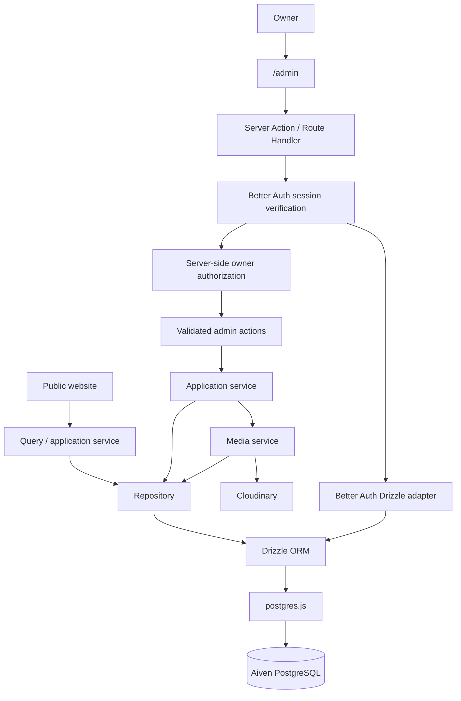
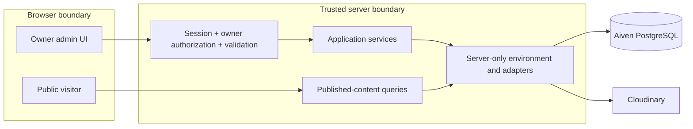
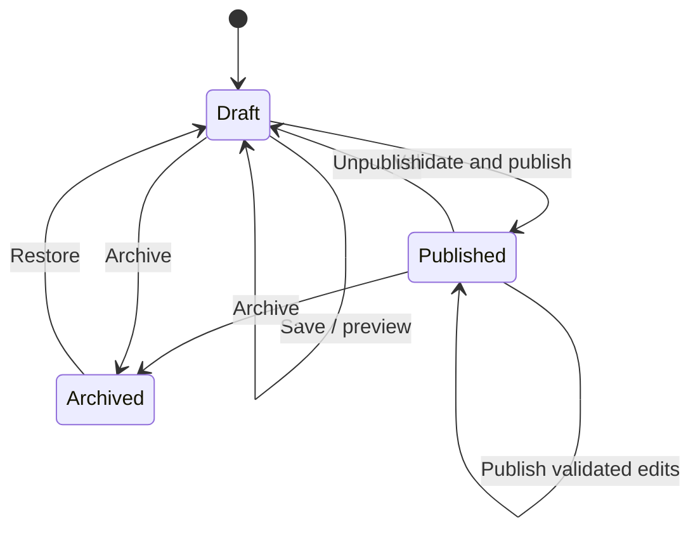

# YOGAAA. architecture contract

Status: implemented application architecture and release contract. This document is
the primary architecture source of truth, not a claim that external production
services have been provisioned or verified.
The repository-level operating map is [AGENTS.md](../AGENTS.md).

## 1. System overview

**Owner:** Yoga Agustiansyah. **Personal brand:** YOGAAA.
**Planned domain:** https://yogaagustiansyah.my.id.

This is a long-term personal digital hub covering Software Development, Artificial
Intelligence, Computer Vision, Research, Product Development, Agentic AI, Technology
Experimentation, and Personal Thoughts / Writing. These are intended subject areas;
they are not evidence of particular achievements or credentials.

The system consists of a public website and a private, single-owner CMS in one
Next.js application. CMS-first means routine content changes eventually require
no source-code change, Git commit, or redeployment. Database content is the source
of editable information; code owns its safe delivery and presentation.

### Locked stack and current state

| Responsibility | Locked choice | Current state |
| --- | --- | --- |
| Application | Next.js 16 App Router, React 19, TypeScript | Installed: Next.js 16.3.4, React 19.2.8, TypeScript 5.9.3; public website and owner CMS routes implemented |
| Styling and fonts | Tailwind CSS 4, Geist, Geist Mono | Tailwind 4.3.3, tokens, public pages, responsive owner workspace, and server-rendered theme overrides present |
| Package management | npm | Existing package-lock.json; retain it |
| Database | Aiven PostgreSQL | Schema/migrations and Base64 CA trust support implemented; verified live connection and migration pending |
| Persistence | Drizzle ORM, Drizzle Kit, postgres.js (`postgres` package) | Installed; typed schema, lazy client, CLI config, and initial migration present |
| Authentication | Better Auth, email/password | Drizzle adapter, login/logout, owner guards, password change, and CLI bootstrap implemented; live provisioning pending |
| Media | Cloudinary, server-authorized uploads | Owner-only upload/browse/metadata/private-delivery/reference-safe deletion and media-library UI implemented; live account verification pending |
| Hosting | Vercel | Deployment target and runbook documented; live deployment pending |

Do not replace these choices without an explicit future requirement. Retain the
existing root `app/` structure and TypeScript/Tailwind setup. Add dependencies only
when the implementation phase needs them, with compatible versions recorded in
the npm lockfile.

Instructions, architecture, the environment template, and the [formal V1 PRD](portfolio-prd.md)
are documented. The [design system](design-system.md) and foundational CSS tokens
are also in place. [Backend infrastructure](database.md) now supplies dependencies,
environment validation, database/Cloudinary services, and module boundaries.
Production schema/provisioning verification and live deployment remain pending. Content,
site settings, semantic theme, and media-management screens are
implemented as documented in [cms.md](cms.md). Auth and media tests use isolated
PostgreSQL via PGlite; Cloudinary behavior is verified at a
mocked SDK boundary, not against the configured account. The PRD supplies product behavior
and logical models within this architecture; it does not define a database schema.

### System flow

The diagram describes request and dependency flow. Public components receive
application data back from the query layer; they never import the database driver
or call Cloudinary SDKs.

## 2. Public application

| Route | Purpose |
| --- | --- |
| `/` | Introduction, featured content, and paths into the hub |
| `/work` | Project index |
| `/work/[slug]` | Project case study |
| `/experience` | Professional and other verified experience |
| `/research` | Research index |
| `/research/[slug]` | Research detail |
| `/thoughts` | Thoughts / articles index |
| `/thoughts/[slug]` | Thought / article detail |
| `/about` | Profile, education, and personal context |
| `/credentials` | Verified credentials and supporting previews |

Pages and layouts are Server Components by default. Use Client Components for
specific interactive controls. Pages compose query results and presentation
components; queries supply typed domain/application models rather than arbitrary
database rows. Public reads return only published content and public fields.
Missing, draft-only, or archived slugs must not reveal private content.

Render meaningful content as semantic HTML with clear headings, landmarks,
accessible controls, and descriptive media alternatives. Metadata, canonical URLs,
social previews, and sitemap entries use the same published source as page content.
SEO overrides are CMS-managed, with code-owned, truthful fallbacks. Exclude admin
and draft content from indexing; indexing directives do not replace access control.

The homepage includes Education after Experience, using up to three visible entries
from the public profile in stored order and linking to `/about#education` for the
full list. Section copy is CMS-owned; missing Education copy uses shared defaults,
while an explicitly empty heading or no visible entries hides the section.

## 3. Admin CMS

| Route | Purpose |
| --- | --- |
| `/admin/login` | Owner email/password login |
| `/admin` | Owner overview |
| `/admin/projects` | Projects, case studies, galleries, and featured selection |
| `/admin/experience` | Experience management |
| `/admin/research` | Research entries and figures |
| `/admin/thoughts` | Thoughts / articles and Markdown editing |
| `/admin/credentials` | Credentials and previews |
| `/admin/media` | Media library and upload management |
| `/admin/master-data` | Reusable project categories and project/research technologies |
| `/admin/settings` | Hero, profile, education/GPA, social/contact details, and site/SEO settings |
| `/admin/settings/theme` | Allowed theme colors |

The login screen is reachable without a session; all other admin pages and private
data require the owner. There is no public sign-up, public user dashboard, or
member system. The administrative identity may be labelled **Owner** in the UI.

Every admin write follows: UI → Server Action / Route Handler → authentication →
owner authorization → input validation → application/repository layer → Drizzle →
PostgreSQL. Media operations additionally use the media service. Protect private
reads at their server entry points as well. A layout redirect or hidden button is
only a UI convenience, never the sole protection for a callable server operation.

## 4. Content and domain layer

| Domain area | CMS-owned information |
| --- | --- |
| Site/profile | Hero copy, profile, education, GPA, social links, contact information |
| Projects | Summaries, case studies, links, covers, galleries, ordering, featured status |
| Experience | Entries, dates, descriptions, ordering |
| Research | Summaries, long-form detail, sources, figures, links |
| Thoughts | Titles, summaries, Markdown articles, publication metadata |
| Credentials | Names, issuers, dates, verification links, previews |
| Shared content | SEO metadata, featured selections, media references |
| Theme settings | Validated values for a selected set of semantic colors |

Code owns application architecture, layout logic, responsive breakpoints, component
anatomy, accessibility behavior, validation, authorization, animation, and data
access. Do not scatter editable content through JSX, generate source files from
CMS edits, or require rebuilds to publish routine content.

Define domain models and application read models independently of Drizzle row
types. Repositories map persistence into these contracts. Distinguish public read
models from owner editing models so private fields cannot be serialized by
accident. Reuse the same query rules for pages, metadata, feeds, and future APIs.

### Long-form content

V1 stores safe Markdown for Thoughts, detailed project case studies, and research.
Treat stored text as untrusted input even when authored by the owner. Use one
controlled Markdown rendering pipeline for preview and publication: raw HTML is
disabled, dangerous link schemes are rejected, and images follow the media policy.
Do not evaluate database-controlled MDX, JavaScript, JSX, or arbitrary components.
Any future HTML-enabled feature requires an explicit sanitization design.

Keep editor behavior separate from persistence and rendering contracts. Reserve a
content-format/version boundary so a future block editor can use a deliberate
content migration without replacing the repository architecture. The choice of
Markdown parser/editor is deferred to implementation.

## 5. Repository and query layer

- **Pages/components:** composition and presentation, without SQL, Drizzle schema imports, or provider SDKs.
- **Queries/application services:** public visibility, use-case orchestration, domain mapping, and cache coordination.
- **Repositories:** typed Drizzle queries, persistence mappings, and transactional operations.
- **Infrastructure adapters:** database client, Better Auth integration, Cloudinary, and environment validation; server-only.

Use these boundaries without adding empty abstractions: a simple query can call a
repository directly, while multi-step publishing uses an application service. Keep
database access and environment modules out of client import graphs with explicit
server-only boundaries. The Better Auth adapter owns authentication persistence;
it is an intentional infrastructure path, not a reason to query auth tables from UI.

Validate mutation input before repository calls, including IDs, slugs, URLs,
ordering, publication state, Markdown limits, and theme values. Use parameterized
queries, explicit selected fields, and transactions for related database changes.
Enforce publication filtering in public repositories/queries, not only in JSX.

The public content repository and query facade are implemented with explicit
presentation selections for site/theme/profile, projects, experience, research,
Thoughts, and credentials. They filter editorial status, collection visibility,
published relationship slots, and ready public media inside the repository. The
query facade now persists public read models in the Next.js Data Cache with bounded
freshness and content-specific tags. Admin mutations expire the corresponding tags
and invalidate affected route paths after a successful database commit. See
[public content queries](content-queries.md).

## 6. Aiven PostgreSQL

PostgreSQL is the durable store for content, settings, media metadata/references,
and Better Auth records. Cloudinary stores the media bytes. Runtime content must
not depend on Vercel's local filesystem or a Git-backed content directory.

Use the server-only `DATABASE_URL` with TLS. The example URL includes
`sslmode=require`; application validation upgrades it in memory to `verify-full`.
`DATABASE_CA_CERT_BASE64` carries the Base64-encoded Aiven CA to postgres.js and
Drizzle Kit, retaining certificate and hostname verification without a deployed file.
Use scoped database access and separate development/preview resources from
production. Never print connection strings, passwords, or sensitive query values.

Use the Node.js runtime for the postgres.js database integration on Vercel. Bound
and reuse connections appropriately for serverless concurrency; determine pool
limits from the Aiven service and deployment model during implementation. Schema
constraints, indexes, migration operations, and backup/restore requirements belong
in `docs/database.md` and `docs/deployment.md`; live deployment validation is pending.

## 7. Drizzle

Drizzle ORM is the persistence implementation, Drizzle Kit manages schema changes,
and postgres.js is the PostgreSQL driver. Keep schema definitions, reviewed
migrations, and repository queries separate from UI. Incorporate Better Auth's
required schema through its supported Drizzle integration; do not invent parallel
authentication records.

Migration files are reviewed and versioned. Applying migrations is a deliberate
operation against a verified environment, never a side effect of a request, owner
login, or an ordinary Vercel application build. Routine CMS edits change data, not
schema, and therefore need no migration or redeployment.

Drizzle Kit must load the same local `DATABASE_URL` and
`DATABASE_CA_CERT_BASE64` as Next.js. Section 11 defines the loading contract; a
separate credential-bearing `.env` file is not allowed.
Dependencies, a typed runtime client, schema definitions, `drizzle.config.ts`, and
the initial generated migration are present. See [database infrastructure](database.md).

## 8. Better Auth and owner identity

Use Better Auth's email/password authentication and its own user, session, and
account structures, plus any supporting structures required by its selected
version. Use its Drizzle adapter against Aiven PostgreSQL. Do not create a duplicate
custom admin-user table or implement independent password/session handling.

The runtime must disable public registration at the authentication API, not merely
omit a sign-up screen. Better Auth provides an email/password `disableSignUp`
option, enabled in the installed runtime configuration. See the
[Better Auth options reference](https://better-auth.com/docs/reference/options)
and [Drizzle adapter documentation](https://better-auth.com/docs/adapters/drizzle).

Authorization verifies a valid session and its association with the one provisioned
owner. Bind the owner to a stable Better Auth user ID in server-controlled persistent
state; a profile name, client role flag, or arbitrary logged-in account must not
grant ownership. The singleton `owner_binding` references the existing Better Auth
user without duplicating it. Ordinary CMS settings cannot reassign this identity.

The runtime exposes only email sign-in, session, sign-out, password change, and
the disabled signup endpoint through `/api/auth/[...all]`. The server checks the
persisted owner in the `/admin/:path*` gate and at private server boundaries.
Session creation also rejects non-owners. Sessions expire after 12 hours without
sliding renewal; cookie caching is disabled. Better Auth rate limits use PostgreSQL
so they survive serverless instance changes. See [authentication operations](authentication.md).

### Owner bootstrap contract

Provision the owner through an explicit, isolated server-side command using the
temporary bootstrap environment values and Better Auth-compatible account creation
and password handling. There must be no public bootstrap route, no registration
window on the hosted app, and no owner creation during normal startup/build.
Rerunning provisioning must not create another owner, overwrite the existing owner's
password, or silently reassign ownership; unexpected existing state fails safely.

After successful provisioning, remove `BOOTSTRAP_OWNER_PASSWORD` from the production
environment and remove temporary local values when no longer needed. Change the
temporary password through the authenticated form at `/admin`. Normal authentication and owner
authorization use persisted auth identity and do not depend on any bootstrap
environment value. Document provisioning and recovery before enabling CMS access.

## 9. Cloudinary and media

Cloudinary stores profile imagery, project covers/galleries, research figures,
article images, credential previews, and social/Open Graph imagery where suitable.
All provider SDK usage and credentials stay inside a server-side media adapter.

Define a provider-neutral `MediaAsset` domain contract with a stable application
ID, media kind, delivery URL, dimensions where applicable, MIME type, size, alt
text/caption, and lifecycle metadata. Keep provider identifiers and transformation
details in the adapter/persistence mapping. Content references application media
IDs; public read models expose only safe presentation fields. Public UI may render
resolved URLs, but must not construct provider SDK calls or own upload logic.

### Authorized upload flow

1. The admin requests upload authorization; the server verifies the session, owner, and allowed media intent.
2. The media service creates a pending record and signs a short-lived, constrained Cloudinary request with a server-controlled folder, delivery type, format, transformation, overwrite policy, and ID. Do not enable public unsigned uploads.
3. The authorized browser sends image bytes directly to Cloudinary, avoiding the Vercel Function body limit. It never receives the API secret.
4. On completion, the server rechecks authorization, queries Cloudinary for authoritative metadata, and verifies the provider identity and allowed asset properties before marking the `MediaAsset` ready; do not trust a browser-submitted URL or MIME type alone.
5. Content publication associates the asset with the appropriate public content and triggers revalidation.

Only the necessary signed upload parameters may reach the authorized browser;
`CLOUDINARY_URL` and its API secret never do. This follows Cloudinary's
[authenticated upload guidance](https://cloudinary.com/documentation/upload_images).

Database transactions cannot roll back external uploads. Track incomplete uploads
and provide safe cleanup for unreferenced assets. Prevent deletion of referenced
assets unless references are deliberately replaced/removed. A draft database flag
does not make a public Cloudinary URL private: use authenticated delivery for media
requiring confidentiality. The implemented policy is detailed in [docs/media.md](media.md).

## 10. Theme settings

The design direction is **Modern Minimalist + Editorial + Calm Technology**, with
**Calm Blue** as the default identity. Retain Geist and Geist Mono. Color values
and component guidance are defined in [docs/design-system.md](design-system.md).

Use semantic CSS variables mapped through Tailwind CSS 4's CSS-first theme:

| Token | Intended role |
| --- | --- |
| `--background` | Page canvas |
| `--surface` | Panels and elevated content surfaces |
| `--foreground` | Primary text |
| `--foreground-secondary` | Readable supporting text on supported light surfaces |
| `--muted` | Nonessential decoration only; not informative text/icons |
| `--border` | Decorative dividers |
| `--border-control` | Visible control boundaries |
| `--accent` | Primary brand/action color |
| `--accent-foreground` | Text/icons on the accent color |
| `--accent-soft` | Subtle accent backgrounds |
| `--accent-secondary` | Secondary accent |

The CMS may eventually edit an explicit allowlist of color values; this token
vocabulary does not automatically make every token editable. Accept validated
color literals only and check affected contrast combinations before saving.
Preserve visible focus states and code-owned safe defaults. Invalid or absent
settings fall back to the validated default palette.

Persist allowed settings in PostgreSQL and apply them through server-rendered CSS
variables with revalidation. The CMS cannot inject arbitrary CSS, selectors,
Tailwind classes, layout grids, breakpoints, component structures, accessibility
behavior, font choices, or animation code.

## 11. Environment variables

[.env.example](../.env.example) is the tracked placeholder contract. Real local
values belong only in root `.env.local`; deployed values belong in Vercel's
environment settings with the correct development/preview/production scope.
[.gitignore](../.gitignore) must retain `.env*` followed by `!.env.example`.
Do not put real credentials into documentation, generated artifacts, or example files.

| Variable | Exposure | Contract |
| --- | --- | --- |
| `NEXT_PUBLIC_SITE_URL` | Public | Local `http://localhost:3000`; planned production `https://yogaagustiansyah.my.id` |
| `DATABASE_URL` | Server-only secret | Aiven PostgreSQL connection URL with TLS |
| `DATABASE_CA_CERT_BASE64` | Server-only trust configuration | One-line Base64 encoding of the Aiven `ca.pem`; decoded and validated before use |
| `BETTER_AUTH_SECRET` | Server-only secret | High-entropy secret of at least 32 characters |
| `BETTER_AUTH_URL` | Server-side configuration | Local auth origin; production origin matches the deployed site |
| `CLOUDINARY_URL` | Server-only secret | Cloudinary account URL containing API credentials |
| `CLOUDINARY_FOLDER_ROOT` | Server-side configuration | `yogaaa-portfolio`; not a secret, but not a public environment variable |
| `BOOTSTRAP_OWNER_NAME` | Provisioning-only server input | `Yoga Agustiansyah`; not the runtime profile source |
| `BOOTSTRAP_OWNER_EMAIL` | Provisioning-only server input | Explicit placeholder until supplied; never used as public contact data implicitly |
| `BOOTSTRAP_OWNER_PASSWORD` | Provisioning-only server secret | Temporary; remove from production after provisioning succeeds |

Only `NEXT_PUBLIC_SITE_URL` is a public environment variable. Never introduce
`NEXT_PUBLIC_DATABASE_URL`, `NEXT_PUBLIC_BETTER_AUTH_SECRET`, or
`NEXT_PUBLIC_CLOUDINARY_SECRET`. A non-public variable name alone is insufficient
protection: do not serialize secrets into props, HTML, responses, logs, or errors.

### Shared Next.js / Drizzle loading contract

Next.js loads root `.env.local` for local development. Drizzle Kit's configuration
invokes `loadEnvConfig` from `@next/env` with the repository root before reading
`DATABASE_URL` and `DATABASE_CA_CERT_BASE64`. The loader is now a direct development
dependency, rather than a transitive import. Keep its installed version aligned with Next.js.
This follows the installed Next.js environment-variable guide for ORM tooling:
`node_modules/next/dist/docs/01-app/02-guides/environment-variables.md`.

Preserve injected deployment environment values, which take precedence. Locally,
keep database credentials only in `.env.local`, without duplicate values in
`.env`, environment-specific files, or Drizzle config. Run operational Drizzle
commands in development/production mode, not `NODE_ENV=test` (Next's loader skips
`.env.local` in test mode). Tests must use explicitly isolated credentials.

Validate missing, malformed, and placeholder configuration before a corresponding
integration runs, and report variable names rather than their values. Do not
require bootstrap values for normal application operation. Shared Zod validation
and Drizzle environment loading are implemented as described in [database infrastructure](database.md).

## 12. Security boundaries

- Enforce authorization for every protected read/write, upload authorization, media deletion, preview, and future integration endpoint. Fail closed when identity is missing or ambiguous.
- Use Better Auth session/cookie handling and retain its origin/CSRF protections. Validate trusted origins/redirect destinations and rate-limit login and sensitive operations during implementation.
- Never return session tokens, password hashes, connection strings, or provider secrets through public content models or logs.
- Validate all content, URLs, Markdown, media, and theme inputs. An owner-authored value is still untrusted rendering input.
- Public queries, metadata, and caches must not contain draft or admin-only data. Keep preview responses private and uncacheable by shared caches.
- Keep secrets in environment configuration, outside editable CMS settings. Public contact email is an explicit content field, separate from the authentication email.
- Use production HTTPS, verified database TLS, and protected deployment settings. Establish owner recovery and environment isolation before launch.

## 13. Content lifecycle

Project, Research, and Thought entries begin as drafts. Other models use validated
saves and, where appropriate, simple visibility flags as defined in the PRD.
Saving or previewing an editorial draft is private; publishing is an explicit
validated action. Draft edits to an existing publication
must not leak into public reads: retain the last published version until publish
succeeds. The database design must represent this separation; a revision-history
editor UI is not required by this contract.

Publication validates required fields, personal-fact placeholders, unique slugs,
media references, and SEO values. The database commit precedes cache invalidation.
Unpublishing/archiving removes content from public detail pages, indexes, featured
sections, metadata, and sitemap output. Slug changes must handle both old and new
URLs with an explicit redirect/removal policy. Avoid broken media references.

Profile, hero, contact, SEO, and theme settings can use an explicit validated save
operation without a full editorial workflow. Their changes still persist in the
database and invalidate all affected public views. Do not publish invented facts
or unresolved placeholders; omit optional unknowns from public views.

## 14. Caching and revalidation strategy

Cache published public read models at deliberate query/service boundaries. Never
place session checks, admin data, or private previews in a shared public cache.
The application currently uses `unstable_cache` because Cache Components are not
enabled. React `cache` additionally deduplicates calls within a server render. Each
public query has a 24-hour safety revalidation and a content-specific invalidation
tag; routine CMS mutations expire relevant tags immediately.

Associate caches with content identity, collection, and site-settings dependencies.
After a successful mutation, invalidate the affected detail/collection caches and
any home, profile, theme, metadata, or sitemap output that depends on them. Revalidate
old and new slug paths where needed. CMS writes must not depend on a build hook or
redeployment to become visible.

Use the installed Next.js 16 documentation to choose APIs and freshness semantics:

- Server Actions can use `updateTag` for immediate expiry/read-after-write behavior.
- Route Handlers use `revalidateTag` with an explicit profile; `{ expire: 0 }` provides immediate expiry where required. The single-argument form is deprecated.
- `revalidateTag` with `"max"` permits stale-while-revalidate; reserve that behavior for content where a delay is acceptable. Content withdrawal must invalidate all serving layers that could expose the withdrawn data.
- Coordinate tag invalidation with `revalidatePath` where route output also needs refreshing; choose bounded freshness/retry behavior before launch.

Do not report a cache failure as a rolled-back database write. Record and surface
the saved-but-refresh-pending state to the owner without sensitive details, and
provide a retry/reconciliation path. Verify withdrawal and fresh reads under the
actual Vercel cache configuration, including failure behavior.

Read `node_modules/next/dist/docs/01-app/01-getting-started/09-revalidating.md`,
the `updateTag`/`revalidateTag` API guides, and the guide for the selected cache mode
when changing this policy. Environment/public URL changes and code changes
may still require deployment; the no-redeployment promise concerns routine CMS data.

## 15. Future extensibility and documentation ownership

Keep the application/domain contracts stable as more content types, a block editor,
search, feeds, or research tooling are introduced. Provider-neutral media models
and explicit persistence boundaries make such extensions possible; they do not
authorize replacing the locked stack. Multi-user accounts, memberships, public
registration, and arbitrary CMS-controlled layouts remain outside V1.

| Document | Responsibility | Status |
| --- | --- | --- |
| `AGENTS.md` | Canonical Codex operating map | Present; preserve the managed Next.js guidance |
| `CLAUDE.md` | Compatibility pointer to AGENTS.md and docs/ | Present; no independent rules |
| `docs/architecture.md` | System boundaries and locked architecture | This document |
| `docs/portfolio-prd.md` | Product requirements, IA, logical content models, scope, acceptance criteria | Present |
| `docs/design-system.md` | Token values, component anatomy, accessibility, responsive/interaction rules | Present; foundational CSS implemented |
| `docs/database.md` | Database infrastructure, schema, owner binding, constraints, migrations, provisioning | Present; initial schema/migration documented |
| `docs/media.md` | Cloudinary upload, delivery, reconciliation, reference and deletion policy | Present; service implemented, live verification pending |
| `docs/deployment.md` | Vercel/Aiven/Cloudinary setup, environment loading, recovery, operations | Present; live execution pending |

Read the relevant specialized document when it exists; until then this contract
governs that area. Update architecture decisions here and keep specialized documents
consistent rather than introducing competing specifications. `AGENT.md` is absent
and should not be introduced as another instruction source. Codex's use of the
canonical filename follows the [official AGENTS.md guidance](https://learn.chatgpt.com/docs/agent-configuration/agents-md).

For documentation-only changes, verify references, route/environment consistency,
placeholder safety, ignore rules, and diff whitespace. Future meaningful code
changes require applicable TypeScript, ESLint, and production-build checks plus
behavioral verification at public page/admin action boundaries. Prioritize owner
authorization, blocked registration, draft isolation, Markdown safety, upload
validation, and publish/revalidation behavior; test observable behavior rather
than internal implementation details.
