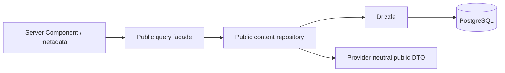

# Public content queries

The public data path is:



Pages import `lib/queries/public-content.ts`. That facade uses the lazy server-only
database and exposes `getSiteSettings`, `getThemeSettings`, `getProfile`,
`getPageSettings`, `getFeaturedProjects`, `getPublishedProjects`,
`getProjectBySlug`, `getExperiences`,
`getExperienceHighlight`,
`getPublishedResearch`, `getFeaturedResearch`, `getResearchBySlug`,
`getLatestThoughts`, `getPublishedThoughts`, `getThoughtBySlug`, and
`getCredentials`. Tests can create the same facade with an isolated database using
`createPublicContentQueries`.

## Public boundary

The repository selects public columns explicitly and maps them to pure types in
`lib/domain/content.ts`. It never returns a Drizzle row wholesale. Project,
research, and Thought queries require `status = published`; invalid, missing,
draft, and archived slugs all return `null`. List order is deterministic. Featured
queries additionally require the featured flag and use featured order. Latest
Thoughts are newest first and accept a server-controlled limit clamped to 1–20.

Profile collections require their visibility flag. Experience and credential
queries do the same. Project categories, technologies, and media use only the
`published` relationship slot. Images must be `ready`, `public`, and image-kind;
private, pending, failed, or draft-slot media is excluded in SQL. Contextual media
alt/caption/decorative values override asset defaults. Provider IDs and private
delivery locators never enter public DTOs.

`getPageSettings` accepts only the fixed public route union and exposes editable
page introductions, empty-state copy, metadata, and public-ready social imagery.
Visible education includes GPA only as the stored value-and-scale pair; presentation
omits both when the pair is absent.

Project detail pages interpret owner-authored level-two Markdown headings as
case-study sections. Markdown remains data, is rendered without raw HTML or
executable MDX, and media continues through `MediaAsset` relationships.

Research detail pages use the same safe section approach for Abstract, Research
Question, Motivation, Methodology, Dataset, System Pipeline, Models, Experimental
Setup, Results, Discussion, Limitations, and Conclusion. Unrecognized level-two
headings remain visible as additional sections. GFM tables present metrics, blockquotes
act as restrained callouts, and public-ready figure media can carry diagrams.

Thoughts may begin with strict Markdown frontmatter containing the optional
`category: Agentic AI` presentation value. The query layer removes that frontmatter
from the public body and derives reading time at 220 words per minute. Inline
Markdown images resolve only `media:<reference-or-asset-id>` values from the
already-filtered public media collection; remote or unresolved Markdown images
are omitted. No raw HTML, MDX, Mermaid execution, or external image URL is enabled.

Public types contain no status, draft payload, revision, internal sort/feature
control, or hidden row. SEO values and safe Markdown are included only on published
detail records where presentation/metadata needs them. Administrative reads and
future mutations must use separate modules and still pass through authentication,
owner authorization, and validation.

No persistent Next.js data cache is enabled at this stage. React request memoization
deduplicates identical shell/page reads within one server render. Adding `use cache`,
cache lifetimes, and tags before publication mutations exist would leave no complete
invalidation path. Introduce them with the publishing services described in the architecture.

## Development seed

The explicit seed command is:

```bash
npm run db:seed:development -- --confirm-development
```

It loads the same `.env.local` database setting as Next.js, refuses production and
test mode, and requires the literal confirmation flag before opening a connection.
Always verify that `DATABASE_URL` identifies the intended migrated development
database without printing it. The command is not called from startup, builds,
migrations, login, or tests.

The transaction takes an advisory lock and inserts stable seed IDs with conflict
preservation. It creates missing singleton profile/theme/site records, the supplied
education row, and the supplied privacy-preserving fall-detection research draft.
Reruns preserve every existing row and create no duplicates; the command never
updates or deletes content. If a conflicting slug already exists, it preserves that
record and skips the research insert.

Only these supplied facts are represented: Yoga Agustiansyah, YOGAAA., Indonesia,
Institut Teknologi Garut, S1 Teknik Informatika, the 2022–2026 period, the supplied
interest areas, and the supplied research direction. The research entry stays
draft because role and other publication requirements are unknown. GPA, employment,
credentials, awards, email, and social URLs remain absent.

`npm run test:content` applies committed migrations to ephemeral PGlite and checks
all visibility boundaries plus seed idempotency. It never reads `.env.local` or
contacts Aiven.
