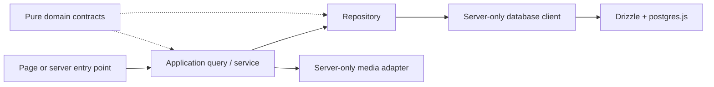
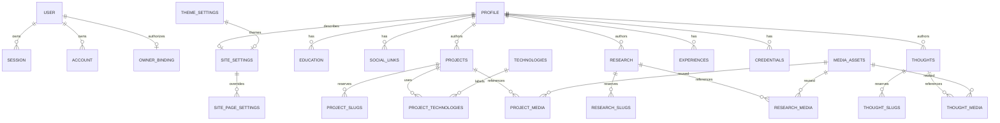

# Database schema and infrastructure

Status: initial Drizzle schema and migration generated, not applied. No live
database connection, owner provisioning, or application queries have been run. Follow the
[architecture contract](architecture.md) and [logical PRD models](portfolio-prd.md#10-domaincontent-model).

## Installed packages

Runtime dependencies are Drizzle ORM 0.45.2, postgres.js 3.4.9 (`postgres`),
Better Auth 1.7.2, Zod 4.5.4, Cloudinary 2.11.0, react-markdown 10.1.0, and
remark-gfm 4.0.1. Drizzle Kit 0.31.10 is a development dependency.
`package-lock.json` records exact installed versions.

The only additional direct package is `@next/env` 16.3.4, matching Next.js. It is
a development dependency required by the architecture to load Next.js environment
files from Drizzle Kit. No separate dotenv package, rich text editor, alternate
database driver, auth provider, or schema-generation plugin was added.

Use Node.js 22 or newer (the current workspace uses 24.15.0). Better Auth's
Kysely dependency requires Node 22, above the original starter's minimum.

## Module boundaries

| Location | Responsibility |
| --- | --- |
| `app/` | Existing Next.js routes and presentation; unchanged |
| `lib/domain/` | Pure JSON value/draft contracts; future public read models stay separate |
| `lib/database/client.ts` | Lazy server-only Drizzle/postgres.js client |
| `lib/database/schema/` | Initial tables/enums; `index.ts` is the explicit schema entry point |
| `lib/repositories/` | Future server-only queries, transactions, and row-to-domain mappings |
| `lib/services/` | Future application queries, orchestration, and revalidation |
| `lib/services/media/cloudinary.ts` | Lazy server-only Cloudinary SDK configuration context |
| `lib/auth/` | Future Better Auth/session/owner checks; no auth instance or permissive stub |
| `lib/validation/environment.ts` | Pure Zod configuration parsers shared by server modules and CLI |
| `drizzle.config.ts` | Standalone Drizzle Kit configuration, with environment loading |
| `drizzle/` | Generated SQL, snapshot, and journal; commit all three together |



Future private entry points must authenticate, authorize the persisted owner, and
validate input before these operations. Obtaining a database or provider client
does not authorize an operation. ESLint restricts direct database/provider imports
in `app/` and future `components/`; server-only markers prevent the current
adapters from entering Client Component graphs. The standalone CLI deliberately
imports only pure validation, never the Next.js runtime client.

## Schema overview

The initial migration is [0000_initial_schema.sql](../drizzle/0000_initial_schema.sql),
with its snapshot and journal under `drizzle/meta/`. It creates 29 tables and six
enums. No rows, personal facts, accounts, passwords, or bootstrap data are seeded.
UUIDs are database-generated for content/association records. Fixed singletons use
`smallint` ID 1 with a check constraint; auth IDs remain Better Auth-managed text.
This uses built-in `gen_random_uuid()` (PostgreSQL 13+), with no extension migration.

| Tables | Purpose and principal relationships |
| --- | --- |
| `user`, `session`, `account`, `verification` | Better Auth core records; session/account reference user with cascading cleanup |
| `owner_binding` | At most one server-controlled pointer to an existing Better Auth user; no duplicate user information |
| `profile` | Public singleton identity, biography Markdown, optional portrait and resume |
| `theme_settings` | Singleton with only four nullable hex overrides; null uses code defaults |
| `site_settings` | Singleton referencing Profile, ThemeSettings, primary SocialLink, and default social image |
| `site_page_settings` | At most seven fixed public route overrides with concrete intro/empty/SEO fields and a media FK |
| `education`, `social_links` | Profile collections with visibility/order; education stores paired GPA value/scale |
| `projects`, `research`, `thoughts` | Editorial identity and last published fields, plus private working payload |
| `project_categories`, `technologies` | Reusable taxonomy with stable unique filter keys |
| `project_category_assignments`, `project_technologies`, `research_technologies` | Many-to-many taxonomy references, separated by draft/published slot |
| `experiences`, `experience_projects` | Profile experience entries and related Projects; at most one visible featured Experience |
| `credentials` | Visible/ordered Profile credentials, optional dates, verification URL and preview media |
| `media_assets` | Provider-neutral asset identity, metadata, privacy and upload availability |
| `project_media`, `research_media`, `thought_media` | Slot-aware cover/gallery/figure/body/social references with local order and alternative text |
| `project_slugs`, `research_slugs`, `thought_slugs` | Per-type ownership of both canonical and historical slugs |

The extra association tables are needed for PRD reuse, draft isolation, media
deletion protection, and slug history. Small, non-relational values (collaborator
credits, evidence links, references, fixed homepage section copy) use typed JSONB
instead of separate tables. Seven route overrides use concrete columns to retain
media foreign keys; there is no general SEO EAV store or revision-history table.



### Better Auth and owner identity

The four core tables match the installed **Better Auth 1.7.2** model definitions,
including `account.issuer` and uniqueness on `(issuer, account_id)`. Older examples
that omit issuer are incompatible with this installed version. TypeScript exports
retain adapter model/property names (`user`, `session`, `account`, `verification`,
`emailVerified`, `userId`, etc.); SQL column names use snake_case. The runtime
Drizzle client now receives the schema. The future Better Auth Drizzle adapter can
use these four exports with provider `pg`; no auth instance or endpoint is created here.

`owner_binding.id = 1` allows at most one binding and restricts deletion of that
user while bound. This is authorization configuration, not another admin-user
table, role system, password store, or public Profile identity. Bootstrap must
atomically create/bind the owner using Better Auth, reject conflicting existing
state, and never silently reassign the pointer. It is not a CMS-editable setting.
Tables alone do not disable signup or authenticate requests: those server checks,
API-level `disableSignUp`, provisioning, recovery, and session policy remain pending.
No optional plugin/rate-limit tables are added without a corresponding auth configuration.

### Editorial storage and publication

Only `projects`, `research`, and `thoughts` have `publication_status`:
`draft`, `published`, `archived`. Required publication fields are nullable while
drafting, but conditional checks reject publication without slug, body, required
summary/excerpt/contribution/type, and publication timestamps. A Profile must
exist first; a minimal editorial row then needs only a title (identity, profile
ID 1, and draft state have safe defaults).

The ordinary editorial columns hold the last published content. Before first
publication they may also hold the initial incomplete draft. Once published,
private changes go into `draft_content`, a nullable version-1 typed JSONB editing
payload; they never overwrite public columns until publish. Null means no separate
pending payload. `revision` supports optimistic concurrency; the application must
increment it and condition updates on the previously read value.

References live outside JSON: taxonomy/media association rows have a `slot` of
`draft` or `published`. Both slots use real foreign keys. Cover/social images are
single-per-slot roles; project galleries and research figures use ordered roles.
Body Markdown references must be indexed in the matching media table when saved;
do not store unmanaged media IDs/URLs in draft JSON or bypass the reference index.

Future publishing is one transaction:

1. Check session/owner, expected revision, complete draft, references, media readiness,
   effective alternatives, URL/Markdown safety, and reserved application slugs.
2. Reserve the intended slug for this record. Copy validated draft fields and
   draft association rows into their published counterparts atomically.
3. Set `published_at` only on first publication. Set `public_updated_at` on every
   publication, retain the first date on republication, set status to published,
   advance revision, and clear the consumed working payload/slot rows.
4. After commit, revalidate affected details, lists, featured selections and SEO;
   report refresh failures separately from persisted changes.

Beginning an edit copies the current public payload and associations into the
private working slot. Read public columns and `slot = 'published'` only when the
parent status is published; never serialize `draft_content`. Draft updates change
`updated_at`/revision but not `public_updated_at`, `published_at`, public taxonomy,
media, featured state, or order. Unpublish/archive changes visibility while
retaining the last publication and reservations; restore sets draft, never published.
These transaction/read behaviors are required service contracts, not implemented
by the schema alone. This is two logical versions, not a full revision-history CMS.

Thoughts use `excerpt`, have no featured/manual-order columns, and sort by original
publication date then ID. Project/Research indexes support public sort order and
featured order. Experience uses visibility and one highlighted record; credentials,
education, and settings have no artificial publication status.

### Slugs, relationships, and deletion

Each slug table reserves its slug as a primary key and records its owner FK. The
editorial table's `(id, slug)` composite FK must reference the same reservation,
so a current slug cannot take another record's historical URL. Insert a new
editorial record with a null slug, insert its reservation, then set the canonical
slug in the same transaction. The initially circular references do not require
deferring foreign keys because the first slug is nullable.

To rename, reserve the new slug for the same ID, update canonical slug, and keep
the old reservation. Resolve old URLs by owner ID and redirect only if that owner
is published. Unpublish/archive must retain the slug and first-publication date;
public reads must not redirect withdrawn records. Hard deletion is intentionally
blocked by retained reservations until an explicit cleanup policy is approved.
Kebab-case/length constraints and uniqueness are enforced in SQL; code-owned
reserved route names require application validation.

Foreign keys restrict deleting referenced media, taxonomy, profiles, primary
contact links, and the bound auth user. Slot-aware reference tables protect both
working and published asset/taxonomy usage. Association rows may cascade when an
explicitly permitted parent deletion occurs; catalog/media targets do not cascade.
The media provider's deletion operation must run through the same reference checks.

### Data accuracy and validation boundaries

Dates supplied at year/month/day precision stay text in `YYYY`, `YYYY-MM`, or
`YYYY-MM-DD` form. SQL checks validate format, full calendar dates, and ordering
at the shared known precision; they do not invent unknown components. Current
education/experience cannot have an end date. Unknown end dates do not imply current.
GPA value and scale must be supplied together, nonnegative, with a positive scale
and value no greater than scale. Numeric values have three fractional digits;
unknown GPA remains null, not zero.

`created_at`/`updated_at` are timezone-aware timestamps. Drizzle supplies update
timestamps through `$onUpdate`; this is not a database trigger for arbitrary SQL.
Operational SQL must maintain timestamps explicitly. Non-editorial mutation services
must also use an optimistic version/timestamp condition for stale-edit protection.
Owner-facing creates allocate appended sort positions transactionally; default
zero on minimal editorial drafts is not an append algorithm.

Singletons can remain incomplete during setup without an artificial draft state.
Launch validation must require all PRD profile/site fields and a visible contact
link with contact purpose. It must also validate route/section copy shapes, social
destinations, icon catalogue keys, theme contrast, research claims, Markdown,
and nested JSON values. SQL checks cover structure/basic URL schemes, not complete
application safety. A populated FK does not prove media readiness or public visibility.

### Provider-neutral media

Media records store provider/resource IDs and delivery metadata, never Cloudinary
API credentials. Provider is an extensible text key, not a Cloudinary-only type.
Pending assets may lack provider IDs/delivery metadata. Ready assets require a
provider ID, secure locator, MIME type and bytes; images also require dimensions.
The API must verify these values with the provider before marking ready.
Availability (`pending`, `ready`, `failed`) is independent from access
(`public`, `private`) and editorial publication.

`secure_url` is required for ready assets and public rendering uses secure delivery.
`url` is optional provider metadata, not a command to use HTTP. For private assets,
store a protected delivery locator and mint authorized delivery at read time;
never assume the access column makes an unrestricted Cloudinary URL confidential.
Default alt/caption/credit/focal values belong to the asset; contextual overrides
belong to media references. Public DTOs omit provider internals and private locators.

## Environment loading and validation

Keep real local values in the existing root `.env.local`. Never copy credentials
into `.env`, another environment file, TypeScript, examples, or logs. The existing
[.env.example](../.env.example) remains the placeholder contract.

Next.js loads the application environment normally. Drizzle Kit's config calls
`loadEnvConfig` from `@next/env` before reading `DATABASE_URL`. It resolves the
repository from the config's own directory, including when invoked elsewhere
with an absolute `--config` path. Injected process/deployment values take
precedence, following Next.js's environment loader. Development is the default
CLI mode; `NODE_ENV=production` selects production precedence. `NODE_ENV=test`
is explicitly rejected because Next.js skips `.env.local` in test mode.

Database validation requires a credentialed PostgreSQL URL with a database name.
Cloudinary validation requires a credentialed `cloudinary://` URL and a nonempty
folder root containing slash-separated letters, numbers, underscores, or hyphens.
Cloudinary query/path configuration overrides are intentionally excluded from
this minimal contract. Angle-bracket placeholders, malformed encoding, missing
values, and unexpected protocols fail with variable names only. Never log the
parsed values, raw Zod errors, SDK configuration, or driver errors/parameters.

Validation is integration-specific and lazy: normal starter startup/build does
not require these services, Better Auth secrets, or owner bootstrap values.
Cloudinary is dynamically imported after validation because its SDK also reads
`CLOUDINARY_URL` during initialization.

## Database client and verified TLS

Call `getDatabase()` only from server-side persistence/application infrastructure.
It creates and reuses one Drizzle/postgres.js instance per process, including
development hot reloads. Importing the module does not initialize the client;
creating the client sends no query. There is no connection check, migration,
owner provisioning, or seed side effect during startup/build.

The current conservative pool limit is one connection per process, with a
20-second idle timeout and 10-second connection timeout. Prepared statements are
disabled until the deployment's pooler compatibility is established. Drizzle
query logging, driver debugging, and automatic notice logging are disabled.
Reuse clients across requests; do not close the pool after every query. A future
isolated operational script should explicitly close its client when finished.
The limit is not global: Vercel instances each have their own pool, so capacity
and concurrency must be reviewed against Aiven before deployment.

The shared validator normalizes the in-memory connection URL to
`sslmode=verify-full`; it does not rewrite `.env.local`. Runtime options also
set `ssl: { rejectUnauthorized: true }`. This is deliberate: the installed
postgres.js driver treats `sslmode=require` as encryption without certificate
verification. Drizzle Kit uses the normalized URL and the installed postgres.js
driver too. See [postgres.js connection/TLS documentation](https://github.com/porsager/postgres).

Before the first real connection, establish trust in the actual Aiven certificate
chain. If a service-specific CA is required, provide it through Node's trusted
certificate configuration before process startup (for example, an approved CA
file via `NODE_EXTRA_CA_CERTS`). Setting that Node startup variable inside
`.env.local` is too late. Never work around a certificate error with
`rejectUnauthorized: false` or `NODE_TLS_REJECT_UNAUTHORIZED=0`. Service trust,
access rights, capacity, backups, and deployment remain to be verified; no live
connection was attempted in this foundation task.

## Development migration workflow

The root config selects PostgreSQL, reads `lib/database/schema/index.ts`, and
uses root `drizzle/` for migrations. It uses strict confirmation
mode with verbose SQL output disabled. See the [Drizzle Kit config reference](https://orm.drizzle.team/docs/drizzle-config-file).

Use npm scripts from the repository. npm executes them at the package root;
`out` is deliberately `./drizzle` because the installed Kit checker mishandles
absolute Windows output paths. Environment loading still resolves from the config
file, independent of the caller's working directory. No credential copy is needed.

```bash
npm run db:generate -- --name=describe_change
npm run db:check
npm exec -- next typegen
npm exec -- tsc --noEmit
npm run lint
```

Generation compares the TypeScript schema to committed local snapshots and writes
SQL; it does not inspect or mutate a database. Review SQL plus journal/snapshot,
and commit them together. `db:check` checks migration metadata consistency; it is
not a SQL execution or database-drift test. Run the migration against a disposable
development database only after verifying its identity, then test constraints and
application behavior. This task generated and inspected SQL but did not apply it.

```bash
# These commands connect to the configured database. Verify the target first.
npm run db:migrate
npm run db:studio
```

Studio binds to `127.0.0.1` and can modify data; it is not a production admin UI.
Close it after local work. No `db:push` shortcut or automatic build migration exists.
Once applied anywhere shared, do not rewrite an existing migration; generate a
forward correction instead. Resolve branch snapshot conflicts before applying.

## Production migration safety

1. Verify deployment scope and the intended Aiven host/database through a secure
   channel without printing connection strings. Never infer a target from an
   existing `.env.local` or assume an unknown database is empty.
2. Review the SQL and current migration journal/drift. The initial migration creates
   tables/types; it must not be applied blindly over pre-existing similarly named
   objects. Plan an explicit baseline/data-preservation strategy for an existing DB.
3. Confirm backups and restore procedures, sufficient privileges, connection
   limits, locks/downtime, and application compatibility. Rehearse on an isolated
   representative database with the same PostgreSQL version and extensions.
4. Apply through one deliberate authorized release operation, monitor its result,
   and verify the journal/schema before releasing dependent code. On failure,
   inspect actual transaction state before retrying; never delete journal entries
   or automatically drop objects to force a pass.
5. Prefer a reviewed forward fix. Destructive cleanup or a backup restore requires
   a separate explicit plan and approval. Do not auto-run migrations at startup,
   login, requests, owner provisioning, or ordinary content publication.

`db:migrate` is a direct Drizzle command, not a production-target detector or an
approval system. Its presence does not authorize running it against any configured DB.

## Cloudinary and authentication readiness

`getCloudinaryContext()` returns a server-only SDK plus the validated folder root.
It sets HTTPS delivery and configures credentials without making network calls.
The folder is an input for a future authorized upload flow, not an enforced
upload policy by itself. No upload, signing endpoint, asset persistence, deletion,
or delivery authorization exists yet. UI must eventually receive provider-neutral
MediaAsset read models, not this context or SDK objects.

Better Auth's core schema is present. No auth endpoint is exposed, no public sign-up is
enabled, and no custom administrator model or owner has been created. The safe
Markdown packages are likewise installed only; their shared renderer still needs
URL/media restrictions and raw-HTML-disabled preview/publication behavior.

## Dependency audit

The installation audit reports four moderate entries through Drizzle Kit's
legacy `@esbuild-kit/esm-loader` → `core-utils` → esbuild dependency chain.
The underlying advisory concerns esbuild's development-server request access:
[GHSA-67mh-4wv8-2f99](https://github.com/advisories/GHSA-67mh-4wv8-2f99).
No esbuild development server is configured. Drizzle Studio is an explicit local
script and was not started in this task.
npm proposes a breaking downgrade to Drizzle Kit 0.18.1, incompatible with the
installed Better Auth peer requirement; no forced downgrade or unverified
transitive override was applied. npm also retains this chain in its `--omit=dev`
audit because Better Auth lists Drizzle Kit as an optional peer (`devOptional`
in the lockfile); do not report a clean production audit. Recheck when a compatible upstream fix is
available. Audit results are point-in-time findings, not a permanent guarantee.
