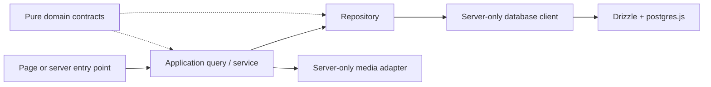

# Database and backend infrastructure

Status: foundations implemented; no application tables, auth schema, migrations,
queries, or live service connections have been created or verified. Follow the
[architecture contract](architecture.md) and [logical PRD models](portfolio-prd.md#10-domaincontent-model).

## Installed packages

Runtime dependencies are Drizzle ORM 0.45.2, postgres.js 3.4.9 (`postgres`),
Better Auth 1.7.2, Zod 4.5.4, Cloudinary 2.11.0, react-markdown 10.1.0, and
remark-gfm 4.0.1. Drizzle Kit 0.31.10 is a development dependency.
`package-lock.json` records exact installed versions.

The only additional direct package is `@next/env` 16.3.4, matching Next.js. It is
a development dependency required by the architecture to load Next.js environment
files from Drizzle Kit. No separate dotenv package, rich text editor, alternate
database driver, auth provider, or schema-generation plugin was added.

Use Node.js 22 or newer (the current workspace uses 24.15.0). Better Auth's
Kysely dependency requires Node 22, above the original starter's minimum.

## Module boundaries

| Location | Responsibility |
| --- | --- |
| `app/` | Existing Next.js routes and presentation; unchanged |
| `lib/domain/` | Future pure content contracts and business rules; no infrastructure imports |
| `lib/database/client.ts` | Lazy server-only Drizzle/postgres.js client |
| `lib/database/schema/` | Reserved for reviewed schema modules; currently a boundary README only |
| `lib/repositories/` | Future server-only queries, transactions, and row-to-domain mappings |
| `lib/services/` | Future application queries, orchestration, and revalidation |
| `lib/services/media/cloudinary.ts` | Lazy server-only Cloudinary SDK configuration context |
| `lib/auth/` | Future Better Auth/session/owner checks; no auth instance or permissive stub |
| `lib/validation/environment.ts` | Pure Zod configuration parsers shared by server modules and CLI |
| `drizzle.config.ts` | Standalone Drizzle Kit configuration, with environment loading |
| `drizzle/` | Future reviewed migration output; not generated yet |



Future private entry points must authenticate, authorize the persisted owner, and
validate input before these operations. Obtaining a database or provider client
does not authorize an operation. ESLint restricts direct database/provider imports
in `app/` and future `components/`; server-only markers prevent the current
adapters from entering Client Component graphs. The standalone CLI deliberately
imports only pure validation, never the Next.js runtime client.

## Environment loading and validation

Keep real local values in the existing root `.env.local`. Never copy credentials
into `.env`, another environment file, TypeScript, examples, or logs. The existing
[.env.example](../.env.example) remains the placeholder contract.

Next.js loads the application environment normally. Drizzle Kit's config calls
`loadEnvConfig` from `@next/env` before reading `DATABASE_URL`. It resolves the
repository from the config's own directory, including when invoked elsewhere
with an absolute `--config` path. Injected process/deployment values take
precedence, following Next.js's environment loader. Development is the default
CLI mode; `NODE_ENV=production` selects production precedence. `NODE_ENV=test`
is explicitly rejected because Next.js skips `.env.local` in test mode.

Database validation requires a credentialed PostgreSQL URL with a database name.
Cloudinary validation requires a credentialed `cloudinary://` URL and a nonempty
folder root containing slash-separated letters, numbers, underscores, or hyphens.
Cloudinary query/path configuration overrides are intentionally excluded from
this minimal contract. Angle-bracket placeholders, malformed encoding, missing
values, and unexpected protocols fail with variable names only. Never log the
parsed values, raw Zod errors, SDK configuration, or driver errors/parameters.

Validation is integration-specific and lazy: normal starter startup/build does
not require these services, Better Auth secrets, or owner bootstrap values.
Cloudinary is dynamically imported after validation because its SDK also reads
`CLOUDINARY_URL` during initialization.

## Database client and verified TLS

Call `getDatabase()` only from server-side persistence/application infrastructure.
It creates and reuses one Drizzle/postgres.js instance per process, including
development hot reloads. Importing the module does not initialize the client;
creating the client sends no query. There is no connection check, migration,
owner provisioning, or seed side effect during startup/build.

The current conservative pool limit is one connection per process, with a
20-second idle timeout and 10-second connection timeout. Prepared statements are
disabled until the deployment's pooler compatibility is established. Drizzle
query logging, driver debugging, and automatic notice logging are disabled.
Reuse clients across requests; do not close the pool after every query. A future
isolated operational script should explicitly close its client when finished.
The limit is not global: Vercel instances each have their own pool, so capacity
and concurrency must be reviewed against Aiven before deployment.

The shared validator normalizes the in-memory connection URL to
`sslmode=verify-full`; it does not rewrite `.env.local`. Runtime options also
set `ssl: { rejectUnauthorized: true }`. This is deliberate: the installed
postgres.js driver treats `sslmode=require` as encryption without certificate
verification. Drizzle Kit uses the normalized URL and the installed postgres.js
driver too. See [postgres.js connection/TLS documentation](https://github.com/porsager/postgres).

Before the first real connection, establish trust in the actual Aiven certificate
chain. If a service-specific CA is required, provide it through Node's trusted
certificate configuration before process startup (for example, an approved CA
file via `NODE_EXTRA_CA_CERTS`). Setting that Node startup variable inside
`.env.local` is too late. Never work around a certificate error with
`rejectUnauthorized: false` or `NODE_TLS_REJECT_UNAUTHORIZED=0`. Service trust,
access rights, capacity, backups, and deployment remain to be verified; no live
connection was attempted in this foundation task.

## Drizzle Kit and future schema work

The root config selects PostgreSQL, discovers `lib/database/schema/**/*.ts`, and
reserves root `drizzle/` for reviewed migrations. It uses strict confirmation
mode with verbose SQL output disabled. See the [Drizzle Kit config reference](https://orm.drizzle.team/docs/drizzle-config-file).

Check the installed CLI without reading credentials or connecting:

```bash
npm exec -- drizzle-kit --version
```

No schema files exist yet. Generation is therefore not a current readiness check;
do not push an empty schema or add dummy tables simply to make it succeed. The
next persistence phase must design content constraints, published/draft storage,
slug history, Better Auth's supported schema, the stable single-owner binding,
and migration/recovery procedures before generating SQL. Never run migrations
from `next build`, requests, login, or ordinary content publication.

## Cloudinary and authentication readiness

`getCloudinaryContext()` returns a server-only SDK plus the validated folder root.
It sets HTTPS delivery and configures credentials without making network calls.
The folder is an input for a future authorized upload flow, not an enforced
upload policy by itself. No upload, signing endpoint, asset persistence, deletion,
or delivery authorization exists yet. UI must eventually receive provider-neutral
MediaAsset read models, not this context or SDK objects.

Better Auth is installed only. No auth endpoint is exposed, no public sign-up is
enabled, and no custom administrator model or owner has been created. The safe
Markdown packages are likewise installed only; their shared renderer still needs
URL/media restrictions and raw-HTML-disabled preview/publication behavior.

## Dependency audit

The installation audit reports four moderate entries through Drizzle Kit's
legacy `@esbuild-kit/esm-loader` → `core-utils` → esbuild dependency chain.
The underlying advisory concerns esbuild's development-server request access:
[GHSA-67mh-4wv8-2f99](https://github.com/advisories/GHSA-67mh-4wv8-2f99).
No esbuild development server or Drizzle Studio is configured by this project.
npm proposes a breaking downgrade to Drizzle Kit 0.18.1, incompatible with the
installed Better Auth peer requirement; no forced downgrade or unverified
transitive override was applied. npm also retains this chain in its `--omit=dev`
audit because Better Auth lists Drizzle Kit as an optional peer (`devOptional`
in the lockfile); do not report a clean production audit. Recheck when a compatible upstream fix is
available. Audit results are point-in-time findings, not a permanent guarantee.
