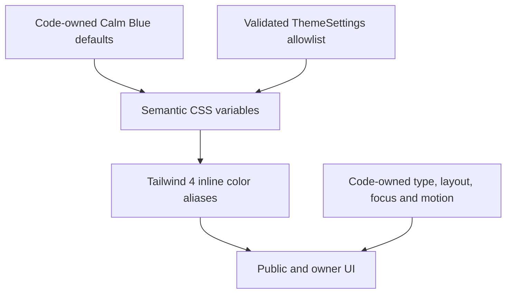

# YOGAAA. design system

Status: accepted visual foundation for V1. Token values and base utilities are
implemented in [app/globals.css](../app/globals.css). Component patterns below
govern the implemented public pages and owner CMS; server-rendered theme
persistence and settings screens are implemented. A separately packaged component
library remains pending.

Follow [AGENTS.md](../AGENTS.md), the [architecture contract](architecture.md),
and the [portfolio PRD](portfolio-prd.md). This document owns visual decisions,
not product scope or persistence. Owner: Yoga Agustiansyah. Brand: **YOGAAA.**

## 1. Visual language

**Modern Minimalist + Editorial + Calm Technology.** The visual signature is
large, carefully spaced Geist headings, small Geist Mono annotations, thin
horizontal rules, generous media, and quiet blue emphasis. A narrow metadata
column beside a wider story creates an editorial rhythm on larger screens.
The impression should be calm, intelligent, technical, thoughtful, mature,
personal, and open to experimentation.

Aim for roughly 75% neutral surfaces and 25% Calm Blue emphasis across a
composition, not a literal pixel quota. Give color to selected actions, section
annotations, and occasional supporting surfaces. Let content and whitespace
create hierarchy. Use asymmetric columns where they clarify relationships;
preserve a natural reading order when stacked.

Avoid generic SaaS hero layouts, Bootstrap-like portfolios, repetitive card
grids, pill-shaped everything, neon/cyan, cyberpunk, purple AI gradients,
glassmorphism, giant shadows, terminal motifs, and fake code backgrounds.
Experimental work belongs in real projects and media, not invented decoration.

## 2. Token architecture and ownership



Root variables such as `--accent` are the runtime color contract. `@theme inline`
maps these to Tailwind utilities such as `bg-accent`, which reference the runtime
variable directly. Type sizes, containers, radii, and breakpoints live in
`@theme`. Responsive layout values live in root variables and media queries;
their spacing aliases also use `@theme inline`.

Use semantic classes in new UI: `bg-background`, `text-foreground-secondary`,
`border-border`, `bg-accent text-accent-foreground`. Never scatter hex values,
stock color families, or dynamically constructed Tailwind class names through
components. Tailwind's existing utilities remain available for the untouched
starter; the starter page is not a reference implementation of this system.

The implementation follows Tailwind's [theme variable](https://tailwindcss.com/docs/theme)
and [custom utility](https://tailwindcss.com/docs/adding-custom-styles) mechanisms.
Keep the existing CSS-first import and PostCSS plugin. No legacy Tailwind config,
new font, UI package, runtime theme provider, or animation dependency is needed.

## 3. Calm Blue palette

Values are opaque sRGB colors. These are defaults, not permission to edit every
token through the CMS.

| Runtime variable | Default | Purpose and restrictions |
| --- | --- | --- |
| `--background` | `#F7F9FC` | Main page canvas |
| `--background-secondary` | `#F1F5F9` | Alternating region or supporting background |
| `--surface` | `#FFFFFF` | Media backing, forms, menus, occasional contained region |
| `--foreground` | `#172033` | Headings, body, essential icons |
| `--foreground-secondary` | `#586A80` | Supporting text, dates, captions, labels, placeholders |
| `--muted` | `#94A3B8` | Nonessential decoration; never informative text or essential icons |
| `--border` | `#D9E2EC` | Decorative dividers; not sufficient to identify controls |
| `--border-control` | `#586A80` | Visible boundaries for inputs and outlined controls |
| `--accent` | `#526D82` | Primary action fill and restrained emphasis |
| `--accent-secondary` | `#6E8CA6` | Secondary decoration; never ordinary text or white-text button fills |
| `--accent-deep` | `#27374D` | Inline links, strong blue labels, dark accents |
| `--accent-foreground` | `#FFFFFF` | Text and icons on `--accent` |
| `--accent-soft` | `#DDEAF3` | Quiet accent region; use foreground or secondary foreground text |
| `--accent-very-soft` | `#EDF4F8` | Larger, very subtle blue regions |
| `--focus-ring` | `#27374D` | Code-owned focus outline |
| `--focus-ring-offset` | `#FFFFFF` | Code-owned contrasting focus halo |

Secondary text is the only refinement to the requested palette: `#64748B`
becomes `#586A80`. The original is 4.34:1 on the secondary background and 3.88:1
on accent-soft, below the normal-text target. The refined value works on all
five supported light surfaces.

### Contrast contract

Ratios below are calculated from the default sRGB values and rounded to two
decimals. Threshold comparisons must use unrounded ratios. Normal text requires
4.5:1, qualifying large text 3:1, and essential non-text boundaries/icons 3:1,
following the PRD's [WCAG 2.2 AA baseline](https://www.w3.org/WAI/WCAG22/quickref/).

| Pair | Ratio | Usage |
| --- | --- | --- |
| Foreground / background | 15.42:1 | Primary text |
| Secondary foreground / surface | 5.54:1 | Supporting text |
| Secondary foreground / background | 5.26:1 | Supporting text |
| Secondary foreground / secondary background | 5.06:1 | Supporting text |
| Secondary foreground / accent-soft | 4.52:1 | Supporting text; do not reduce opacity |
| Secondary foreground / accent-very-soft | 4.99:1 | Supporting text |
| Accent foreground / accent | 5.43:1 | Filled action label |
| Accent-deep / accent-soft | 9.85:1 | Links and blue text on soft regions |
| Muted / surface | 2.56:1 | Decoration only |
| Border / surface | 1.31:1 | Decorative rule only |

Accent text on accent-soft is 4.43:1: use `text-accent-deep` for inline links
on light surfaces. White on accent-secondary is 3.52:1 and is not an ordinary
text pairing. Never infer contrast from a token's name. Do not use opacity to
weaken essential text or use color alone to communicate selection, errors, or
publication state. Text over imagery requires a tested opaque backing.

## 4. Typography

Use the existing `next/font` Geist and Geist Mono variables in the root layout.
The body now inherits Geist through the semantic `font-sans` mapping. Geist Mono
is for dates, indices, concise technical annotations, and actual code. Avoid
monospace paragraphs and all-caps body copy. Use 400 for reading text, 500 for
headings and interface emphasis, and 600 only for local emphasis when needed.

| Role / utility | Size at 16px root | Line height | Tracking | Weight | Use |
| --- | --- | --- | --- | --- | --- |
| Display / `text-display` | Fluid 48–88px | 1.08 | -0.045em | 500 | One leading statement |
| H1 / `text-h1` | Fluid 40–72px | 1.12 | -0.035em | 500 | Page title |
| H2 / `text-h2` | Fluid 30–44px | 1.20 | -0.025em | 500 | Major section |
| H3 / `text-h3` | Fluid 20–24px | 1.35 | -0.015em | 500 | Entry or subsection title |
| Body large / `text-body-lg` | Fluid 18–20px | 1.65 | 0 | 400 | Introduction or short summary |
| Body / `text-body` | 16px | 1.65 | 0 | 400 | Reading and form text |
| Caption / `text-caption` | 14px | 1.50 | 0 | 400 | Supporting explanation |
| Metadata / `type-metadata` | 12px | 1.50 | 0.04em | 400 | Geist Mono dates, indices, short labels |

The `text-*` roles include size, line height, tracking, and weight through
Tailwind's [font-size companions](https://tailwindcss.com/docs/font-size).
`type-metadata` adds the mono family and tabular numerals to `text-metadata`.
It does not choose a color: pair it with `text-foreground-secondary`.
Do not use 12px metadata for instructions, form labels, or body copy.

Fluid sizes use `clamp()` with rem bounds and mixed rem/vw preferred values;
the exact formulas live in CSS. Keep the root font size at the browser default,
allow text to wrap, and verify zoom without clipping. Type roles do not choose
HTML semantics: one meaningful page H1 may use display styling, while successive
sections use correctly nested H2/H3 elements. Avoid fixed line breaks that only
work at one viewport. Use `text-balance` selectively for short headings.

Reading content is capped at 42rem; aim for roughly 60–75 characters per line.
Use paragraph gaps of 1–1.5rem and larger spacing before section headings. The
safe-Markdown renderer styles headings, lists, links, quotes, managed figures,
tables, and code explicitly. Thoughts use a 46rem reading measure; Research uses
the same measure within the wider editorial grid. No typography plugin is required.

## 5. Containers, grid, and rhythm

Use a mobile-first layout. Preserve Tailwind's breakpoint values: `sm` 40rem,
`md` 48rem, `lg` 64rem, `xl` 80rem, `2xl` 96rem. These are code-owned layout
thresholds, not device detection. The root media-query thresholds must stay
aligned with the corresponding theme breakpoints.

| Container token | Maximum | Use |
| --- | --- | --- |
| `--container-site` / `container-site` | 80rem / 1280px | Outer site shell, generous media |
| `--container-content` / `max-w-content` | 64rem / 1024px | Focused archive or mixed content region |
| `--container-reading` / `max-w-reading` | 42rem / 672px | Long-form body text |
| `--container-form` / `max-w-form` | 28rem / 448px | Compact owner forms |

`container-site` centers a width of
`min(100% - 2 × page gutter, 80rem)`. Apply it once at the outer boundary;
inside, use `w-full max-w-reading` or the appropriate width cap. Do not nest
shells and accidentally double gutters. Use `mx-auto` for centered reading
columns, or align them to the story column when accompanying metadata.

| QA viewport | Gutter token | Effective outer margin | Shell width | Grid / gap | Section / compact spacing |
| --- | --- | --- | --- | --- | --- |
| 390px mobile | 20px | 20px | 350px | 4 / 16px | 64 / 40px |
| 768px tablet | 32px | 32px | 704px | 8 / 24px | 80 / 48px |
| 1280px laptop | 64px | 64px | 1152px | 12 / 32px | 120 / 64px |
| 1440px desktop | 64px | 80px | 1280px | 12 / 32px | 120 / 64px |

At `lg` (1024–1279px), gutters are 48px, grid gaps 32px, and section spacing
96px / compact 64px. These values assume a 16px root. Also review 320, 375,
1024px, intermediate widths, landscape, 200% text scaling, and 400% browser
zoom/reflow. Do not hide overflow on the body to mask layout problems.

`editorial-grid` provides 4/8/12 equal tracks using `minmax(0, 1fr)` and the
responsive gap. It is an alignment grid, not a requirement to show that many
items. Children must specify their span: start with `col-span-full`; introduce
metadata/story spans such as `lg:col-span-3` / `lg:col-span-9` where useful.
Keep DOM reading order logical, let long text wrap, and use `min-w-0` where
necessary. No semantic content should be repositioned by CSS into a misleading
reading order.

Retain Tailwind's 4px base spacing scale. Prefer 4, 8, 12, 16, 24, 32, and 48px
for local composition. Use `gap-grid-gap`, `px-gutter`, `py-section`, and
`py-section-compact` for responsive semantic spacing. At shared section
boundaries, assign the full vertical gap to one side (for example `pb-section`
then no additional top gap); do not accidentally double the intended rhythm.

## 6. Borders, radii, and depth

Use 1px `border-border` rules between editorial rows or regions. Use
`border-border-control` for an input boundary or an outlined action. A divider
does not need to look like a box. Reserve 2px for deliberate emphasis or focus.

| Radius | Value | Use |
| --- | --- | --- |
| `rounded-none` | 0 | Editorial regions and rules; default |
| `rounded-media` | 2px | Restrained media corners |
| `rounded-control` | 4px | Buttons and fields |
| `rounded-panel` | 8px | Occasional menu/dialog/panel, not every section |

Use no decorative shadow by default. Hierarchy comes from space, typography,
rules, and surface changes. The focus halo is an accessibility treatment, not
elevation. Fully rounded shapes are limited to genuinely circular controls or
appropriate avatars; do not make every label and action a pill.

## 7. Interaction and accessibility

The base `:focus-visible` treatment is a 2px deep outline with 3px offset and a
3px white halo. The two colors keep focus discernible across different adjacent
fills. Keep the entire indicator unclipped and unobscured. Do not remove it
unless replacing it with an equally visible tested treatment. Forced-colors
mode uses the system `Highlight` outline and removes the shadow.

Use `min-h-target` and, for standalone icon actions, `min-w-target`: 2.75rem
(44px at the default root). Normal text links may remain inline, with sufficient
line spacing. Hover is supplementary; all actions must work by keyboard and touch.
Links in prose are underlined at rest, with `text-accent-deep` and a visible
underline offset. Navigation uses a persistent underline or equivalent shape
for the current route, plus `aria-current="page"` when implemented.

| State | Future component requirement |
| --- | --- |
| Default | Clear label and semantic color pairing; no ambiguous clickable decoration |
| Hover | Underline/emphasis or a separately contrast-tested color pair; no required hover-only content |
| Focus | Global two-color indicator; preserve focus through UI updates |
| Active/selected | Persistent non-color cue plus correct native/ARIA semantics |
| Disabled | Native/ARIA behavior as appropriate, clear explanation, no false affordance; avoid fading an entire explanatory region |
| Loading | Keep dimensions stable, label the operation, expose busy/status semantics |
| Error/success | Explicit text and an appropriate icon/status announcement; color never carries the message alone |

Status-specific colors and complete form/button/dialog implementations will be
defined with those components. Do not repurpose the accent as an unexplained
error/success signal or introduce untested colors now. Form labels remain
visible; placeholders are not labels and use readable secondary foreground.
Menus/dialogs must follow the PRD's keyboard, focus, dismissal, and announcement
requirements. A CSS foundation alone does not establish WCAG conformance.

## 8. Motion

| Token | Value | Intended use |
| --- | --- | --- |
| `--duration-fast` | 140ms | Hover and small state feedback |
| `--duration-normal` | 220ms | Future menu/panel transitions |
| `--duration-slow` | 360ms | Optional restrained introduction |
| `--ease-calm` / `ease-calm` | `cubic-bezier(0.2, 0.8, 0.2, 1)` | Smooth settling |

`transition-interactive` transitions color, background, border, and underline
color at the fast duration. For a future opacity/transform transition, use an
explicit property with `duration-(--duration-normal) ease-calm`. Avoid
`transition-all`, bouncing, parallax, cursor effects, and perpetual decoration.
Do not fade important copy below its contrast target during ordinary states.

Reduced-motion CSS shortens animations/transitions to 0.01ms, removes delays,
limits animations to one iteration, and restores automatic scrolling. It is a guardrail, not a
motion implementation. Future animated entrances must default to visible content
and use `motion-safe:` for hidden/translated starting states. Behavior must not
depend on an animation completing; JavaScript motion must respect the same
preference. The public shell uses native smooth anchor scrolling with that reduced-
motion override, plus short header and mobile-dialog state transitions. It adds no
parallax, perpetual motion, or animation-dependent behavior.

## 9. Composition and media patterns

These patterns are implemented by the public site and owner workspace.

| Pattern | Anatomy and hierarchy |
| --- | --- |
| Section heading | Small mono index/label, strong heading, optional short introduction, restrained archive link |
| Editorial entry | Thin divider, metadata column, title and summary, optional supporting media; generous row spacing |
| Selected project | Large image followed by title/context or an adjacent story column; avoid a rounded card wrapper by default |
| Research / Thought | Reading-first title, concise date/topic metadata, narrow body, figures that can extend into the wider content column |
| Experience | Chronological editorial rows with dates, role/organization, and verified description |
| Primary action | Accent fill, accent-foreground label, small control radius; usually one dominant action per region |
| Secondary action | Text link or outlined control; distinguish it without competing visual weight |
| Owner editor | Clear labels, grouped fields, dependable save/preview/publish placement; narrower layouts stack editor and preview |

The homepage retains the PRD's curated hierarchy: Hero → Selected Work →
Experience Highlight → Featured Research → Latest Thoughts → Short About →
Contact CTA → Footer. Archives use editorial lists where appropriate. The owner
workspace reuses the same rules with a compact navigation rail, bordered lists,
and a wide editing surface; sticky save controls remain restrained and never hide
validation feedback. Primary
navigation remains Work, Experience, Research, Thoughts, About, and Contact ↗;
Credentials stays secondary through About/footer. Never invent copy, dates,
projects, or achievements.

Use real owner-provided media through the provider-neutral MediaAsset contract.
Prefer 16:10 project covers where cropping is appropriate, natural
ratios for research figures and credentials, and intentional portrait crops.
The homepage portrait uses its stored intrinsic ratio, with square and 3:4 images
supported without a forced crop. Its thin border, offset accent plane, corner marks,
and dimension label form one editorial frame pattern; components must use semantic
tokens for every layer. When a portrait is unavailable, the existing abstract
technical field remains the non-personal fallback.
Preserve legibility of diagrams/documents with `object-contain` rather than
blindly cropping them. Supply accurate alt text or empty alt for decoration,
reserve dimensions to avoid layout shifts, and provide responsive image sizes.
Do not use invented certificates, fake project screenshots, or stock people
as identity content. Missing media should omit the region or use an explicit
editorial placeholder in private previews.

Homepage actions follow a two-level hierarchy: the solid accent action leads to
selected work (or the Work archive when no feature exists), and the outlined
secondary action uses the configured primary contact destination. Public social
links use a small, code-owned icon catalogue plus a visible text label; unknown
networks fall back to the generic link icon. The CMS never accepts arbitrary SVG,
icon markup, or CSS.

## 10. CMS theme integration

V1 is a single light Calm Blue theme. No OS-driven dark palette or theme-mode
switcher is defined.

The CMS permits these color keys in V1: `--background`, `--surface`,
`--foreground`, `--border`, `--accent`, `--accent-foreground`, `--accent-soft`,
and `--accent-secondary`. All other colors, type, spacing, grid, breakpoints,
focus, radii, and motion remain code-owned. When an override is active, code maps
the validated foreground to secondary text, control borders, and focus treatment;
it maps the validated accent to deep-accent text and the soft accent to very-soft
surfaces. This keeps non-editable semantic roles coherent with the selected palette.

The implemented flow is owner authentication and authorization → validate an exact
allowlist of six-digit hex values → verify supported contrast pairs → save the
validated settings → revalidate affected public output. Serialize approved
values into server-rendered root CSS variables. Invalid or absent settings use
the complete safe defaults. Do not accept arbitrary CSS, selectors, URLs,
Tailwind classes, JavaScript, or layout values.

Validation includes accent-foreground on accent (4.5:1), foreground on the page,
surface, and accent-soft backgrounds (4.5:1), accent against page and surface
backgrounds (4.5:1 because it is also link text), and accent-secondary against
page and surface backgrounds (3:1 for non-text emphasis). Check every additional pairing introduced by a component,
including its hover/active states. Keep focus colors code-owned and do not
introduce opacity modifiers that bypass these checks. A preview must use the
same semantic variables as the public UI, without changing published settings
until an authorized save succeeds.

## 11. Foundation usage and verification

The following is a usage reference, not a page to add:

```tsx
<section className="container-site pb-section" aria-labelledby="section-title">
  <div className="editorial-grid">
    <p className="type-metadata col-span-full text-foreground-secondary lg:col-span-3">
      [Section label]
    </p>
    <div className="col-span-full min-w-0 lg:col-span-9">
      <h2 id="section-title" className="text-h2 text-balance">[Section title]</h2>
      <p className="mt-6 max-w-reading text-body-lg">[Owner-provided summary]</p>
    </div>
  </div>
</section>
```

After foundation changes, compile CSS with the installed Tailwind/PostCSS
toolchain, run `npm exec -- next typegen`, `npm exec -- tsc --noEmit`, and
`npm run lint`; run a production build when relevant. Check documentation/token
consistency and `git diff --check`. Add no dependency solely for these checks.

Before shipping actual UI, inspect the four target viewports and the extra PRD
reflow widths, readable text pairings, keyboard focus, forced colors, reduced
motion, long content, and zoom. Verify a scoped accent override changes semantic
utilities without rebuilding CSS. Inspect real media and content when available;
the untouched starter is not evidence that portfolio UI meets these criteria.
