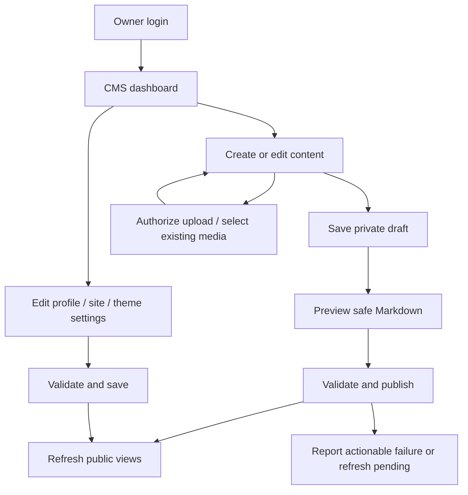
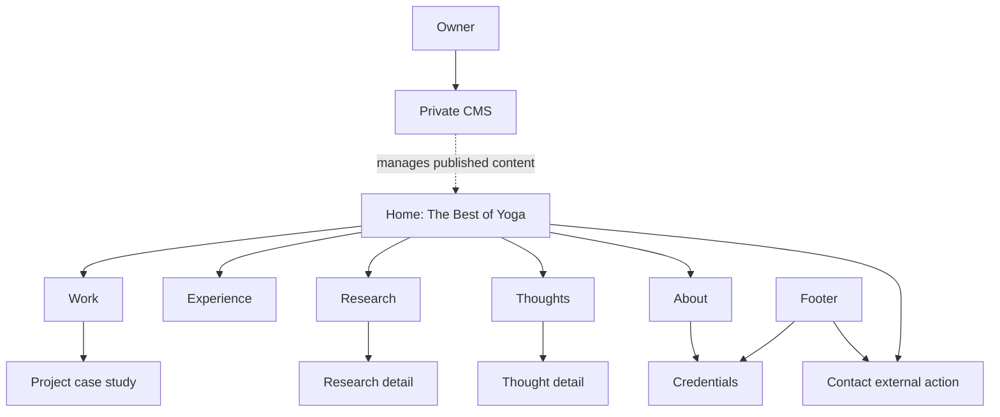
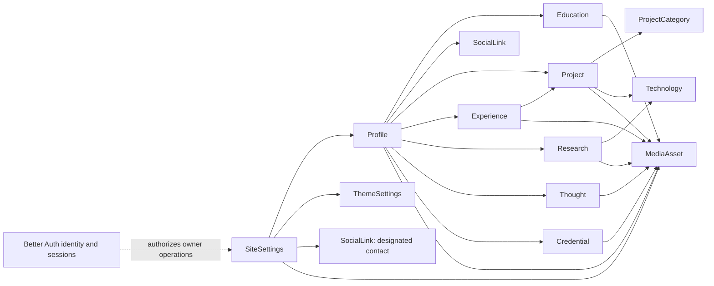
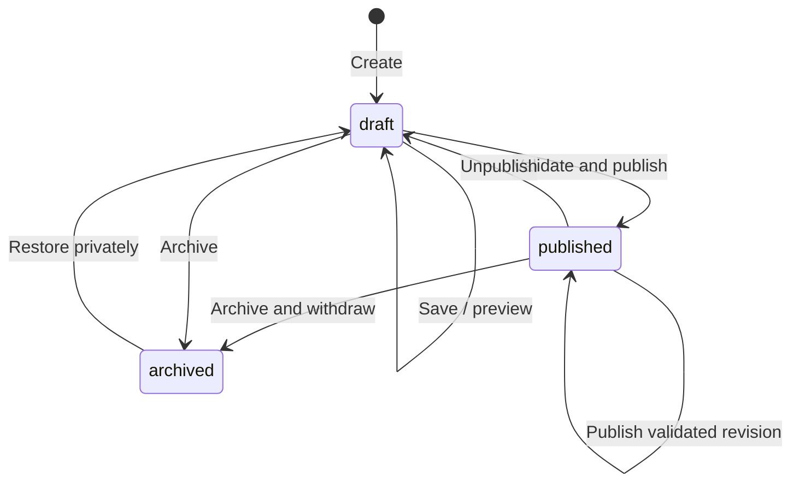

# YOGAAA. — Product Requirements Document

Version: 1.1. Date: 2026-09-03. Status: V1 product baseline implemented in the
repository; live service integration, owner-approved content, and production
acceptance verification remain release gates.

**Owner:** Yoga Agustiansyah. **Brand:** YOGAAA.
**Production domain:** [yogaagustiansyah.my.id](https://yogaagustiansyah.my.id).
This is the intended production address, not a claim of a live deployment.

[AGENTS.md](../AGENTS.md) is the canonical project guidance. The
[architecture contract](architecture.md) governs technical boundaries; this PRD
defines product behavior, content, and acceptance. CLAUDE.md is a compatibility
pointer, not a source of independent requirements. The logical product model remains
authoritative while database and application implementations are documented in
their specialized guides.

## 1. Product vision

YOGAAA. is Yoga Agustiansyah's long-term personal digital hub: profile, software and
AI portfolio, professional experience, academic/research work, credentials, personal
publication through **Thoughts**, and a private owner CMS.

### Problem statement

Visitors need a coherent way to understand Yoga, examine evidence, read his thinking,
and decide whether to contact him. A page of disconnected links or an undifferentiated
archive makes that assessment difficult. Content maintained inside source code also
makes ordinary updates dependent on development and deployment work.

### Solution

A curated homepage introduces the strongest available material, while dedicated
archives and detail pages provide depth. A single-owner CMS maintains the content,
media, metadata, and permitted theme values without routine code edits or redeployment.

| Visitor question | Product answer |
| --- | --- |
| Who? | Yoga Agustiansyah |
| What? | Software × AI × Research |
| Proof? | Work, Research, Experience |
| Thinking? | Thoughts |
| Background? | About, Education, Credentials |
| Action? | Explore or Contact |

The subject areas describe the intended hub. Specific expertise, employers, education,
results, dates, and credentials require owner-supplied evidence.

## 2. Goals

| Goal | V1 success measure |
| --- | --- |
| Immediate orientation | The initial homepage view identifies Yoga, communicates Software × AI × Research, and offers exploration/contact paths. |
| Credible depth | Every published project/research detail explains Yoga's contribution and provides only supported claims and links. |
| Curated discovery | The homepage presents bounded selections and links into archives rather than copying complete lists. |
| Owner independence | All content categories in section 13 can be maintained through the CMS without a source edit, Git commit, migration, or redeploy. |
| Safe publication | Drafts stay private; publication and withdrawal consistently update public pages and discovery surfaces. |
| Usable across devices | Public exploration, reading, contact, and essential owner workflows meet sections 16–18. |
| Durable structure | Adding content does not require a new page implementation; newly published slugs work after deployment. |

Validate orientation in a short first-visit walkthrough: the visitor should locate
identity, focus, proof, and contact within roughly 30 seconds. This is a proposed
usability task, not a measured result. Traffic, leads, ranking, and citation gains
have no invented baseline or promised target; analytics integration is not a V1 gate.

## 3. Non-goals

- Public registration, visitor accounts, memberships, comments, or a public dashboard.
- Multiple administrative owners, team roles, or delegated editorial approvals.
- E-commerce, payments, booking infrastructure, or a CRM.
- A public contact form/email-delivery backend; V1 uses a configured contact link.
- Database-executed MDX, arbitrary HTML, scripts, or a CMS page/layout builder.
- A rich block editor, scheduled publication, revision-history UI, or multilingual routing.
- Site-wide search, subscriptions/newsletters, or AI chat/search features at launch.
- Claiming unsupported achievements, awards, metrics, qualifications, or availability.
- Changing the locked stack or treating the site as only a campaign landing page.

## 4. Personas

These are audience needs, not assertions that named organizations or people use the site.

| Persona | Main need | Useful proof | Desired next action |
| --- | --- | --- | --- |
| Recruiter | Understand fit and contribution quickly | Selected work, role descriptions, experience | Review background, contact |
| Collaborator | Assess shared interests and working approach | Case studies, research, Thoughts | Discuss collaboration |
| Developer | Understand implementation and trade-offs | Technology context, repository/demo links when available | Explore related work |
| AI practitioner | Distinguish experiments from supported outcomes | Methods, evaluation context, limitations | Read technical detail, contact |
| Researcher | Understand research questions and provenance | Methods, contribution, references, publication links | Read source material, connect |
| Potential client | Assess relevant delivery capability | Problem, scope, contribution, supported outcomes | Contact about a project |
| Technology community visitor | Discover work and ideas worth sharing | Accessible summaries and stable URLs | Explore or share |
| Reader | Read personal writing comfortably | Thoughts, publication/update dates, author context | Read another article |
| Owner | Keep the hub current safely | Clear editing, preview, publishing, and feedback | Maintain content without development work |

## 5. Public user journeys

| Journey | Path | Successful outcome |
| --- | --- | --- |
| Evaluate fit | Home → selected work → case study → Experience/About → Contact | Visitor understands contribution and finds a real contact channel. |
| Explore technical work | Work → optional category/technology filter → project detail | Visitor finds relevant work and can follow available evidence links. |
| Examine research | Research or search result → research detail → supplied references | Visitor can distinguish Yoga's role, research context, and limitations. |
| Read thinking | Thoughts or shared article URL → article → Thoughts index | Reader gets a complete article and a clear way to continue. |
| Verify background | About → education → Credentials → available verification link | Visitor sees accurate background without invented values. |
| Browse on mobile | Menu → any public route → Contact | Navigation and reading work without hover or precision gestures. |
| Encounter missing content | Unknown/withdrawn slug → useful not-found state → archive | No draft data is exposed and exploration can continue. |

### Public user stories

1. As a first-time visitor, I want to identify Yoga and his focus immediately, so that I can decide where to explore.
2. As a recruiter, I want selected work near the top of the homepage, so that I can assess relevant evidence quickly.
3. As a recruiter, I want clear experience and contribution descriptions, so that I can evaluate fit without guessing.
4. As a collaborator, I want project context and limitations, so that I can identify useful collaboration opportunities.
5. As a developer, I want categories and technology labels, so that I can find work relevant to my interests.
6. As a developer, I want repository and demo links when supplied, so that I can inspect the underlying work.
7. As an AI practitioner, I want evaluation context and supported outcomes, so that I can interpret claims responsibly.
8. As a researcher, I want research questions, methods, and sources, so that I can understand the work and its provenance.
9. As a researcher, I want publication status described accurately, so that I do not mistake an experiment for a peer-reviewed publication.
10. As a reader, I want comfortable long-form typography, so that I can read Thoughts without distraction.
11. As a reader, I want reliable publication and update dates, so that I can understand the article's context.
12. As a potential client, I want a visible contact action, so that I can start a conversation using Yoga's chosen channel.
13. As a visitor, I want About to connect to education and credentials, so that I can understand Yoga's background.
14. As a visitor, I want unknown optional information omitted, so that I am not misled by placeholders.
15. As a community visitor, I want stable, shareable detail URLs, so that I can direct others to specific work or writing.
16. As a mobile visitor, I want all navigation and links available by touch, so that I can explore without a desktop.
17. As a keyboard user, I want visible focus and logical navigation, so that I can use every public control.
18. As a screen-reader user, I want meaningful headings and image alternatives, so that I can understand the content structure.
19. As a visitor with reduced-motion preferences, I want restrained motion, so that reading and navigation remain comfortable.
20. As a visitor, I want helpful empty and missing-page states, so that I can continue exploring without seeing private content.

## 6. Owner journey

The owner is provisioned through the architecture's controlled bootstrap process.
Normal use starts at login, not registration. Successful login opens the dashboard;
an expired session requires reauthentication before any protected read or mutation.

The owner can return to drafts, update published content without revealing unfinished
edits, remove publication, restore archived entries to drafts, and control homepage
selections. Publishing shows success only when the write and required refresh outcome
are known; a saved-but-refresh-pending result remains distinguishable from failure.

### Owner user stories

21. As the owner, I want email/password login without public registration, so that the CMS remains private.
22. As the owner, I want protection on every admin operation, so that a direct request cannot bypass the interface.
23. As the owner, I want an overview of drafts and recent changes, so that I know what needs attention.
24. As the owner, I want to edit hero and global copy, so that I can update positioning without touching JSX.
25. As the owner, I want to maintain my profile, education, and optional GPA, so that background information stays accurate.
26. As the owner, I want to manage projects, categories, and technologies, so that the work archive can grow without code changes.
27. As the owner, I want to update experience and its ordering, so that professional context remains current.
28. As the owner, I want to maintain research content and sources, so that visitors can evaluate the work responsibly.
29. As the owner, I want to write and preview Thoughts in Markdown, so that publishing is straightforward and safe.
30. As the owner, I want to save incomplete drafts, so that unfinished work never becomes public accidentally.
31. As the owner, I want draft edits to preserve the current publication, so that I can revise a live entry safely.
32. As the owner, I want to publish new content at a new slug without redeploying, so that routine publishing is independent of development.
33. As the owner, I want to unpublish and archive entries, so that withdrawn material disappears from public discovery.
34. As the owner, I want to maintain credentials and their evidence, so that background claims remain verifiable.
35. As the owner, I want to upload and reuse media with alternatives and captions, so that content stays accessible and consistent.
36. As the owner, I want referenced media protected from accidental deletion, so that existing publications do not break.
37. As the owner, I want to choose and order homepage highlights, so that the homepage shows my strongest available work.
38. As the owner, I want to manage social and contact links independently from login identity, so that public contact details remain intentional.
39. As the owner, I want to edit SEO titles, descriptions, and share images, so that public previews reflect the content.
40. As the owner, I want to preview and save a constrained accent palette, so that I can adjust the brand without breaking readability or layout.
41. As the owner, I want validation and save errors that preserve my input, so that I can correct problems without redoing work.
42. As the owner, I want unsaved-change and stale-edit warnings, so that navigation or multiple tabs do not silently discard work.
43. As the owner, I want clear session expiry and logout behavior, so that administrative access ends predictably.
44. As the owner, I want a documented provisioning and recovery process, so that losing a session or temporary bootstrap value does not require public registration.

## 7. Information architecture

Primary navigation is **Work → Experience → Research → Thoughts → About**, with
**Contact ↗** as a separate action. The YOGAAA. brand links to Home. Credentials is
secondary navigation from About and the footer, not a sixth primary navigation item.
Navigation destinations/order are product structure, not arbitrary CMS-configurable routes.

Contact uses one visible owner-configured SocialLink designated as the primary
contact destination. Allow a validated `mailto:` address or an external HTTPS
contact channel. Do not infer the destination from the authentication email.
The arrow communicates an external action; it does not require a new browser tab.

## 8. Route requirements

### Public routes

| Route | Required behavior |
| --- | --- |
| `/` | Curated hierarchy in section 9; no complete archive duplication. |
| `/work` | Published projects, summaries, optional media, category/technology context, and working detail links; simple category/technology filtering when applicable. |
| `/work/[slug]` | Title, summary, Yoga's role, case-study Markdown, applicable technologies, optional gallery/evidence links, and return path to Work. |
| `/experience` | Visible experience ordered by the owner; roles, organizations, supplied dates, contribution text, and honest current/end-date treatment. |
| `/research` | Published research summaries, research type and supplied date/context, detail links. |
| `/research/[slug]` | Question/context, contribution, methods, findings/limitations in Markdown, optional figures and supplied citations/links; distinguish editorial publication from academic standing. |
| `/thoughts` | Published Thoughts, newest first, with title, excerpt, publication date, and detail links. |
| `/thoughts/[slug]` | Complete safe-Markdown article, author context, publication/update dates, optional media, and return path to Thoughts. |
| `/about` | Profile, short/long biography, visible education, optional GPA with scale, social/contact paths, and Credentials link. |
| `/credentials` | Visible credentials with issuer, available dates, optional preview and verification link; never present unavailable evidence as verified. |

Archive pages must expose every eligible item as content grows using bounded,
linkable pagination rather than loading an unbounded list. Work filters are optional
to use, reflected in URL query state, clearable, and compatible with back/forward
navigation; do not add category/technology detail routes in V1. Research/Thoughts
need pagination but no advanced filter/search system.

Provide accessible loading/error feedback where data is deferred. A successful
empty query gets truthful empty-state copy and an alternative route; a service
failure gets a recoverable error, not a false empty archive. Unknown, draft-only,
and archived detail URLs return a not-found result without their titles or bodies.

### Private routes

| Route | Required behavior |
| --- | --- |
| `/admin/login` | Email/password sign-in; accessible to unauthenticated visitors; no sign-up controls or registration API availability. |
| `/admin` | Owner-only counts by publication state, recent edits, and shortcuts; not a visitor analytics dashboard. |
| `/admin/projects` | Project editing, publication, sorting/featuring, categories and technologies as inline management tools. |
| `/admin/experience` | Experience editing, visibility, ordering, homepage highlight selection. |
| `/admin/research` | Research editing, Markdown preview, publication, sources, figures, featuring. |
| `/admin/thoughts` | Thought editing, Markdown preview, draft/publish/archive management. |
| `/admin/credentials` | Credential editing, visibility, ordering, previews and verification links. |
| `/admin/media` | Authorized uploads, selection/reuse, metadata, reference inspection, safe deletion. |
| `/admin/settings` | Global/site copy, profile, education/GPA, social/contact links, page SEO, and owner session/password controls through Better Auth. |
| `/admin/settings/theme` | Preview, validate, save, and reset the allowed theme values. |

Editors may use panels or route query state within these routes. This PRD does not
require additional admin URL surfaces. All protected content is server-authorized;
authorization cannot depend on reaching it through a particular layout.

## 9. Homepage hierarchy

The homepage is **THE BEST OF YOGA**: an editorial selection, not a concatenation
of archive pages. The sequence is code-owned; copy and eligible selections are CMS-owned.

| Order | Section | Purpose and source | V1 selection rule |
| --- | --- | --- | --- |
| 1 | Hero | Identity from Profile; headline/intro and CTA copy from SiteSettings | One introduction, primary exploration link to Work, secondary Contact action. |
| 2 | Selected Work | Strong project evidence | Up to 3 published, featured Projects ordered by featuredOrder. |
| 3 | Experience Highlight | Concise professional context | One visible, featured Experience; archive contains the complete account. |
| 4 | Featured Research | Research depth | Up to 2 published, featured Research entries ordered by featuredOrder. |
| 5 | Latest Thoughts | Current writing | Up to 3 published Thoughts ordered by first publication date, newest first. |
| 6 | Short About | Human/background context | Profile short biography and link to About; no full education/credential list. |
| 7 | Contact CTA | Clear next action | SiteSettings copy and the designated visible contact link. |
| 8 | Footer | Secondary navigation and identity | Public social links, About/Credentials access, and owner-managed footer copy. |

Do not auto-promote unfeatured projects/research to fill space. Empty optional
collection sections are omitted while primary archive navigation remains available.
Show fewer items when fewer qualify. The Experience editor enforces at most one
featured entry. Featuring never overrides publication or visibility. Hero, Short
About, Contact CTA, and Footer need real minimum content for launch. Cards link to
details and section links lead to full archives. Limits and ordering algorithms
belong to product code; the owner selects and orders content within them.

## 10. Domain/content model

These are logical domain contracts, not database tables, ORM definitions, SQL types,
or migration instructions. Better Auth owns authentication-related models. Profile
is public editorial information, not a duplicate administrator identity.

### Shared conventions

- All models have a stable application `id` and system-maintained `createdAt`/`updatedAt`. Relationships below refer to application identities, never credentials or vendor SDK objects.
- Required fields mean required for a valid saved non-editorial record or a published editorial record. A new Project, Research, or Thought draft needs only an internal working title, identity, and `draft` state; publication fields can remain incomplete in that draft.
- `status` exists only on Project, Research, and Thought, with exactly `draft`, `published`, and `archived`. `isVisible` is a simple inclusion flag on selected non-editorial records, not a publishing lifecycle.
- Optional absence is distinct from zero or false. Unknown GPA, dates, links, credentials, and metrics are not guessed. Preserve supplied date precision instead of inventing a day or month. Validate date ranges and distinguish an explicit current role from an unknown end date.
- `sortOrder`/`featuredOrder` sort ascending, with stable application ID as the final tie-breaker. New ordered records append by default. A featured item requires a featuredOrder; hidden or unpublished items never qualify.
- `SeoMetadata` is a reusable value object: optional title override, description override, and social-image MediaAsset reference. Missing values fall back to public content and SiteSettings. Canonical URLs are derived from the production origin and route/slug, not arbitrary owner-entered cross-domain canonical URLs.
- `MediaReference` is a value object: MediaAsset ID plus optional contextual alt text, caption, and local order. Informative images require effective alt text; decorations must be explicitly marked. Body references use the controlled Markdown/media renderer.
- All referenced content used in public output must be visible/published as appropriate. Deleting a referenced record requires reassignment/removal of its references or a clear blocked-operation result.

### 10.1 SiteSettings

| Aspect | Requirement |
| --- | --- |
| Purpose | Singleton for global presentation copy, homepage section copy, public page SEO, and contact selection. |
| Required fields | brandName (YOGAAA.), siteTitle, defaultSeoDescription, contentLanguage, heroHeadline, heroIntro, heroExploreLabel, contactCtaHeading, contactCtaLabel, footerCopy, and primaryContactLinkId for a launch-ready site. |
| Optional fields | Hero/contact supporting copy, text overrides for fixed homepage sections, public-page introductions/empty-state copy, route-keyed SeoMetadata overrides, default social-image reference. |
| Relationships | One Profile; one ThemeSettings; primaryContactLinkId references a visible SocialLink with contact purpose. Route-keyed copy/SEO accepts only existing public route identities. |
| Slug | Not required; this is a singleton, not a public detail page. |
| Status | Not required; explicit validated save. Missing launch fields block launch readiness rather than creating a publication state. |
| Featured | Not supported; homepage selections come from content records. |
| Sort/order | Singleton; fixed navigation/homepage section order stays code-owned. |
| Media | Default social/Open Graph image through MediaAsset; no uploaded CSS or scripts. |
| SEO | Site-wide defaults and overrides for the seven fixed public pages; detail pages use their content metadata. |

The environment owns the deployment origin. SiteSettings cannot edit credentials,
owner authorization, trusted origins, or arbitrary routes. Brand/identity changes
remain subject to truthful owner input and the project identity contract.

### 10.2 ThemeSettings

| Aspect | Requirement |
| --- | --- |
| Purpose | Singleton holding validated overrides to the Calm Blue palette. |
| Required fields | Identity; the effective palette must resolve all required semantic tokens from code defaults plus permitted overrides. |
| Optional fields | Overrides for background, surface, foreground, border, accent, accent-foreground, accent-soft, and accent-secondary; an empty override set means defaults. |
| Relationships | Used by SiteSettings/public rendering; owned through the same owner authorization boundary. |
| Slug | Not required. |
| Status | Not required; preview is transient, save is explicit. |
| Featured | Not supported. |
| Sort/order | Singleton; no ordering. |
| Media | None; no background uploads through theme settings. |
| SEO | No independent SEO; must not change content identity or canonical URLs. |

### 10.3 Profile

| Aspect | Requirement |
| --- | --- |
| Purpose | Public identity and biography for Yoga, distinct from login identity. |
| Required fields | displayName (Yoga Agustiansyah), focusLine, shortBiography, biography for a launch-ready profile. |
| Optional fields | Location, availability text, portrait reference, supplied resume HTTPS link; omit unknowns. Biography may use the controlled Markdown renderer for basic formatting. |
| Relationships | One SiteSettings; many Education, SocialLink, Experience, Project, Research, Thought, and Credential records. Public authorship is the Profile, not an exposed auth record. |
| Slug | Not required; represented by Home/About. |
| Status | Not required; explicit validated save. |
| Featured | Not supported; the singleton is the source for Hero/Short About. |
| Sort/order | Singleton; related collections have their own ordering. |
| Media | Optional portrait MediaAsset; informational alternatives required. |
| SEO | Supplies truthful identity/author fields and About defaults; page overrides live in SiteSettings. |

### 10.4 Education

| Aspect | Requirement |
| --- | --- |
| Purpose | Academic background displayed within About. |
| Required fields | profileId, institutionName, qualificationOrProgram, isVisible, sortOrder. |
| Optional fields | Field of study, supplied start/end dates, isCurrent, description, institution HTTPS link, paired GPA value and scale. GPA is never assumed to use a particular scale. |
| Relationships | Belongs to Profile; optional institution-mark MediaAsset. |
| Slug | Not required; no education detail route in V1. |
| Status | Not required; explicit save and visibility flag. |
| Featured | Not supported. |
| Sort/order | Owner-defined sortOrder on About; known dates may inform initial ordering without inventing dates. |
| Media | Optional institution mark; education remains understandable without a logo. |
| SEO | Contributes visible background to About only; no independent page metadata. |

### 10.5 SocialLink

| Aspect | Requirement |
| --- | --- |
| Purpose | Intentional public social profiles and contact destinations. |
| Required fields | profileId, label, destination, purpose (social or contact), isVisible, sortOrder. |
| Optional fields | Supported platform/icon key from a code-owned catalogue; no arbitrary icon markup. |
| Relationships | Belongs to Profile; a contact link may be designated by SiteSettings. |
| Slug | Not required. |
| Status | Not required; explicit save and visibility flag. |
| Featured | Not supported; designation as primary contact is a separate reference. |
| Sort/order | Owner-defined order in About/footer; primary Contact placement is fixed. |
| Media | None; platform icons come from code. |
| SEO | Valid public social-profile URLs may inform identity metadata; private/login email must never be inferred. |

Social destinations require HTTPS. Contact destinations allow HTTPS or validated
`mailto:`. Deleting or hiding the active contact link requires selecting a valid
replacement in the same operation once the site is launch-ready.

### 10.6 Project

| Aspect | Requirement |
| --- | --- |
| Purpose | Evidence of software, AI, product, and experimentation work. |
| Required fields | profileId, title, slug, summary, roleOrContribution, bodyMarkdown, status, isFeatured, sortOrder; publishedAt when first published. |
| Optional fields | Category references, technology references, supplied project dates, collaborator credits, repository/demo/external links, cover/gallery/body media, SeoMetadata, featuredOrder when featured. |
| Relationships | Belongs to Profile; many ProjectCategory and Technology references; many MediaAssets through cover/gallery/body/SEO usage. |
| Slug | Required before publication; unique among Projects, stable after publication with the rename policy in section 11. |
| Status | Required: draft/published/archived; distinguish working draft from published version. |
| Featured | Supported; only published featured records enter Selected Work. |
| Sort/order | Work uses sortOrder then publishedAt descending then stable ID; homepage uses featuredOrder. |
| Media | Optional cover, ordered gallery, body images, and social image. Text-first presentation must work without a cover. |
| SEO | Per-project SeoMetadata; fallback title/summary and a suitable supplied image; canonical Work detail URL. |

The case study must explain the problem/context, Yoga's actual role, approach,
supported outcome or current state, and limitations/trade-offs. Numeric results
are optional and require evidence; unfinished or exploratory work can be described
honestly without pretending it was shipped or successful.

### 10.7 ProjectCategory

| Aspect | Requirement |
| --- | --- |
| Purpose | Reusable classification and Work filtering. |
| Required fields | name, key, sortOrder. key is a stable unique filter identifier. |
| Optional fields | Short description. |
| Relationships | Many Projects can reference a category; deleting a used category requires reassignment/removal. |
| Slug | No route slug required; key is used only in filter/query state. |
| Status | Not required. Categories appear publicly only when referenced by eligible published projects. |
| Featured | Not supported. |
| Sort/order | sortOrder for filter choices and category labels. |
| Media | None in V1. |
| SEO | Labels contribute to project context; no category landing pages or independent SEO. |

### 10.8 Technology

| Aspect | Requirement |
| --- | --- |
| Purpose | Reusable technology labels without implying a proficiency score. |
| Required fields | name, key, sortOrder; key is a stable unique filter identifier. |
| Optional fields | Official HTTPS reference link and supported icon key. |
| Relationships | Many Projects and Research entries can reference a Technology. |
| Slug | No route slug; key supports Work filter/query state only. |
| Status | Not required; public labels come only from eligible published relationships. |
| Featured | Not supported. |
| Sort/order | sortOrder for filters and technology labels. |
| Media | No uploaded technology-logo library in V1; optional code-owned icon. |
| SEO | Context within Projects/Research only; no independent technology page. |

### 10.9 Experience

| Aspect | Requirement |
| --- | --- |
| Purpose | Professional or other accurately labelled experience and contribution. |
| Required fields | profileId, roleTitle, organizationName, description, startDate at known precision, isCurrent, isVisible, isFeatured, sortOrder. |
| Optional fields | End date, employment/context label, location, organization HTTPS link, organization mark, related Project references, featuredOrder when featured. Unknown end dates remain unlabelled rather than inferred as current. |
| Relationships | Belongs to Profile; optional related Projects and MediaAsset. Public related projects must be published. |
| Slug | Not required; displayed on Experience, no detail route. |
| Status | Not required; explicit save and visibility flag. |
| Featured | Supported; at most one featured Experience record in V1, and it must be visible to appear on Home. |
| Sort/order | Owner-defined sortOrder; homepage uses the single eligible highlight. |
| Media | Optional organization mark with appropriate alternative text. |
| SEO | Contributes to Experience page content; page metadata is managed in SiteSettings. |

### 10.10 Research

| Aspect | Requirement |
| --- | --- |
| Purpose | Academic/research work and clearly identified studies or experiments. |
| Required fields | profileId, title, slug, summary, researchType, roleOrContribution, bodyMarkdown, status, isFeatured, sortOrder; publishedAt on first publication. |
| Optional fields | Academic/research stage, supplied research/publication dates, collaborators, institution/venue, citation text, DOI/HTTPS source links, Technology references, cover/figures/body media, SeoMetadata, featuredOrder when featured. |
| Relationships | Belongs to Profile; many Technologies and MediaAssets; references/citations are content value objects rather than invented publication records. |
| Slug | Required before publication; unique among Research entries. |
| Status | Required: draft/published/archived. This is website visibility, not academic publication/peer-review status. |
| Featured | Supported for Featured Research when published. |
| Sort/order | Research index uses sortOrder then publishedAt descending then stable ID; homepage uses featuredOrder. |
| Media | Optional cover, ordered figures, body images, and social image; figures need captions/context where necessary. |
| SEO | Per-entry SeoMetadata; title/summary fallbacks; canonical research detail URL. |

The body covers question/context, method, Yoga's contribution, supported observations,
limitations, and applicable sources. Do not require a DOI, venue, or claimed academic
publication for a legitimate experiment; do not invent them to fill the form.

### 10.11 Thought

| Aspect | Requirement |
| --- | --- |
| Purpose | Personal publication, technical writing, and reflections under Thoughts. |
| Required fields | profileId, title, slug, excerpt, bodyMarkdown, status; publishedAt on first publication. |
| Optional fields | Cover/body media, references, SeoMetadata; reading-time estimate is derived, never an invented personal fact. |
| Relationships | Belongs to Profile as author; MediaAssets for cover/body/social image. |
| Slug | Required before publication; unique among Thoughts. |
| Status | Required: draft/published/archived, with draft/published separation. |
| Featured | Not supported in V1; Latest Thoughts is chronological and not a manually curated slot. |
| Sort/order | publishedAt descending then stable ID. Editing does not reset first publication date; no manual sortOrder. |
| Media | Optional cover, body images, and social image. Reading works without imagery. |
| SEO | Per-article SeoMetadata, title/excerpt fallback, canonical Thought URL, truthful author/date information. |

### 10.12 Credential

| Aspect | Requirement |
| --- | --- |
| Purpose | Owner-supplied certifications, awards, or other accurately labelled credentials. |
| Required fields | profileId, title, issuerName, credentialType, isVisible, sortOrder. |
| Optional fields | Issue/expiry dates, public credential identifier, description, verification HTTPS link, preview MediaAsset. Sensitive identifiers must be omitted/redacted. |
| Relationships | Belongs to Profile; optional preview MediaAsset. |
| Slug | Not required; no credential detail route. |
| Status | Not required; explicit save and visibility flag. Expiry is derived from a supplied date, not a publication state. |
| Featured | Not supported; discoverable through About/footer and Credentials. |
| Sort/order | Owner-defined sortOrder. |
| Media | Optional preview image with accessible text equivalents; no credential is represented only as an image. |
| SEO | Supports visible Credentials/About context; SiteSettings owns page SEO, with no automatic verified badge. |

### 10.13 MediaAsset

| Aspect | Requirement |
| --- | --- |
| Purpose | Provider-neutral identity and metadata for managed media. |
| Required fields | Application ID, kind, filename/label, access classification (public/private), operational availability; a ready asset requires verified delivery locator, MIME type, byte size, and dimensions for images. |
| Optional fields | Default alt text, default caption, credit/source, crop/focal metadata within supported controls. Provider identifiers are adapter-owned operational metadata, not UI contracts. |
| Relationships | Referenced by SiteSettings, Profile, Education, Project, Experience, Research, Thought, Credential, and SEO/media value objects. |
| Slug | Not required; use application IDs for content references. |
| Status | No draft/published/archived field. Upload availability (pending/ready/failed) is operational and does not grant publication. |
| Featured | Not supported. |
| Sort/order | Media library newest first; galleries/figures use relationship-local order without changing global asset order. |
| Media | This is the reusable asset; public UI receives safe URLs, dimensions, and alternatives rather than Cloudinary SDK data. |
| SEO | Supplies appropriate share images and alternatives; no independent public media-detail route in V1. |

Only verified ready assets can be attached for publication. Confidential originals
must use protected delivery; an unlisted or draft reference does not secure a public URL.

### 10.14 Model relationships at a glance

These relationships express content behavior without specifying database cardinality
tables, join-table names, storage types, or an additional administrator model.

## 11. Publishing lifecycle

Project, Research, and Thought use exactly these publication states:

| Operation | Required outcome |
| --- | --- |
| Create/save draft | Incomplete publication fields are permitted; no public page, snippet, sitemap entry, or featured card is created. |
| Preview | Uses the same safe-Markdown presentation rules as publication, requires owner access, and is excluded from shared caches/indexing. |
| Edit a published record | Working changes remain private; status and public reads continue to refer to the last successful publication until the owner publishes the revision. |
| Publish | Validate required content, slug, references, media readiness, and metadata; commit atomically, then refresh dependent public output. First publication assigns publishedAt; later published revisions update a separate public content-update timestamp. |
| Unpublish | Transition to draft and withdraw all public detail, list, homepage, metadata, and sitemap representations. |
| Archive | Preserve the record privately, stop public discovery, and remove effective homepage eligibility. |
| Restore | Return to draft, never automatically to published. |
| Delete | V1 prefers archival for editorial content. If deletion is offered, require confirmation and resolve references; it is not an implicit effect of hiding or archiving. |

Retain the last published content and the working draft as distinct logical versions;
this requirement does not prescribe a schema or a full revision-history product.
Private draft edits must not change public `dateModified`. Republishing an archived
or unpublished record preserves its original first-publication date, unless an
explicit future backdating/import policy is introduced. Scheduled/future publication
and arbitrary date backdating are outside V1.

Slugs are unique within each editorial type and reserved after publication,
including while archived. On an explicit published-slug change, the old URL redirects
to the new canonical URL only while the record is public. Both old/new URLs must
stop exposing the record on withdrawal. Never redirect to a private preview.
Detect collisions with current and historical slugs before changing publication.

Featured selection/order is part of an editorial record's published presentation:
changing it in a working draft does not affect the live homepage until publish.
Experience visibility/highlight and non-editorial settings use explicit validated
saves with immediate refresh. Taxonomy changes shared by live records warn the
owner about their scope before save and refresh all affected public views.

Successful public refresh must work for a newly created slug absent at build time.
If the database write succeeds but refresh fails, preserve the data, report refresh
pending, and offer a safe retry. Do not claim withdrawal complete until fresh public
requests no longer reveal withdrawn content. Already downloaded visitor copies and
external search caches cannot be recalled; the contract covers application-controlled
delivery and indexing output.

## 12. Media requirements

Cloudinary is the provider; MediaAsset is the application contract. The owner must
be able to upload, browse, reuse, caption, and inspect references to profile imagery,
project covers/galleries, research figures, article images, credential previews,
and social images. Optional media must not become a requirement to fabricate artwork.

V1 accepts JPEG, PNG, and WebP uploads through a code-owned MIME/extension allowlist,
with a 10 MiB per-file input cap, at most 8000 pixels per side, and at most 20
megapixels. The browser uses owner-authorized signed direct uploads to Cloudinary
so file bytes do not cross Vercel's smaller Function request-body boundary; server
reconciliation is required before an asset becomes ready. Arbitrary documents, SVG/HTML uploads, video hosting, and remote URL
ingestion are not V1 media-library features. Existing external documents may be linked
through validated HTTPS content links. Publish optimized derivatives rather than
shipping original upload sizes to every visitor.

The upload flow authenticates and authorizes the owner before server-side upload or
issuance of constrained signed parameters, verifies the result server-side, and then
persists ready-asset metadata. Apply type/size constraints at the provider/server,
not only in the file picker. The browser must never receive the Cloudinary secret.
Upload failures provide retry feedback and do not create publishable broken references.

Select existing assets with contextual alt text/captions and gallery ordering.
Replacing an asset updates intended references deliberately; deletion shows usage
and blocks removal while referenced. Incomplete/unreferenced uploads need safe
cleanup. Confidential material uses authenticated delivery and private preview;
the owner explicitly approves the redacted/public derivative before public use.

## 13. CMS requirements

| Area | Required owner controls |
| --- | --- |
| Global/site copy | Edit hero, section introductions, contact CTA, footer, and permitted page copy; fixed IA/layout stays in code. |
| Profile | Edit name/focus/biography, optional portrait, location, availability, resume link. |
| Education/GPA | Add/edit/remove entries, visibility/order, dates and optional GPA value plus scale. |
| Projects | Create/edit/preview/save draft/publish/unpublish/archive/restore; manage links, galleries, categories, technologies, sorting and featured order. |
| Experience | Add/edit/remove, visibility/order, contribution details, at most one homepage highlight. |
| Research | Editorial workflow, source/citation details, figures, technology labels, sorting/featuring. |
| Thoughts | Editorial workflow with publication dates, safe Markdown preview, cover/body media, SEO. |
| Credentials | Add/edit/remove, visibility/order, issuer and optional date/preview/verification information. |
| Social/contact | Manage validated links and designate a visible primary contact independently of login email. |
| SEO | Site defaults, fixed-page overrides, and editorial detail overrides; no arbitrary scripts or head markup. |
| Media | Authorized upload, library selection, alternatives/captions, usage inspection, safe deletion. |
| Featured content | Select/order eligible Projects/Research and the Experience highlight; Latest Thoughts remains chronological. |
| Theme | Preview/save/reset the eight allowed semantic color overrides. |

Long-form editing supports basic Markdown headings, paragraphs, lists, emphasis,
links, blockquotes, fenced code, tables, and approved media references. Preview
must not execute raw HTML, MDX, scripts, or unsafe link schemes. Code blocks are
display-only. Complex embeds and an extensible component/plugin editor are out of scope.

Every editor needs labelled fields, inline validation, pending/success/failure
feedback, explicit save/publication controls, and preservation of unsaved input
after recoverable errors. Warn before leaving dirty edits or destructive removal.
If another tab has saved a newer version, detect the conflict and require refresh
or deliberate reconciliation rather than silently overwriting it. Autosave is not
required in V1; never imply unsaved text is stored.

After session expiry, reject mutations and provide a reauthentication path without
claiming a save succeeded. Protect credentials and draft data from shared storage;
do not persist passwords or sensitive editor contents in public caches. A successful
logout prevents new private reads/writes. Login throttling and useful generic
failure messages belong to the authentication integration.

## 14. Theme customization

Direction: **Modern Minimal + Editorial + Calm Technology**. Default identity:
**Calm Blue**. Fonts remain Geist and Geist Mono. Use purposeful hierarchy,
comfortable reading width, restrained motion, and consistent semantic tokens.

| Token | V1 CMS permission |
| --- | --- |
| `--background` | Editable validated color |
| `--surface` | Editable validated color |
| `--foreground` | Editable validated color |
| `--muted` | Code-owned default |
| `--border` | Editable validated color |
| `--accent` | Editable validated color |
| `--accent-foreground` | Editable validated color |
| `--accent-soft` | Editable validated color |
| `--accent-secondary` | Editable validated color |

V1 accepts six-digit hexadecimal color literals for these overrides. Preview shows
representative text, links, buttons, focus states, and cards before explicit save.
Reject invalid colors or a palette that fails the supported contrast combinations.
Saving persists ThemeSettings and refreshes public CSS variables without redeploy;
reset removes overrides and restores the validated code-owned palette. Invalid
stored values must fall back safely.

Do not expose arbitrary CSS, selectors, classes, JavaScript, font changes, layouts,
grids, breakpoints, component anatomy, animation code, or accessibility behavior.
Exact default palette values and component states belong in the
[design-system specification](design-system.md). A theme-mode switcher and
additional editable token groups are future scope.

## 15. SEO

SEO is based on accurate visible content and stable navigation, not invented claims
or promises of AI citations. Public pages must render meaningful text and links on
the server, with descriptive titles, one clear primary heading, and meaningful
section headings. Supply a sensible description from a CMS override or the visible
summary; do not expose unresolved placeholders in snippets.

Use the production HTTPS origin for canonicals and social URL metadata. Provide
Open Graph/social previews with an approved image where available and a truthful
text fallback. Default favicon/Next.js branding must be replaced by the YOGAAA.
identity before launch. Public page SEO and CMS edits use the same published data.

Generate sitemap entries only for eligible public pages/current published slugs;
remove withdrawn entries on refresh. Index detail pages and base archives; use an
explicit canonical/noindex policy for Work filter combinations to avoid indexing
every combination. Preserve crawlable pagination so deeper content is reachable.
Owner preview, login/admin, and deployment previews are noindex and excluded from
the production sitemap; private access still requires authorization.

Structured data, where used, must match visible facts: Profile identity, site
identity, articles, breadcrumbs, and accurately typed creative/research work.
Do not label every research entry a peer-reviewed paper or create fictitious
ratings/credentials. Published dates reflect publication; modification dates change
only when public content changes. Training-crawler policy is separate from public
search indexing. AI-specific files or special markup are not a V1 acceptance gate.

## 16. Accessibility

Target **WCAG 2.2 AA** across public pages and core owner workflows, using the
[W3C quick reference](https://www.w3.org/WAI/WCAG22/quickref/) as the review baseline.
Acceptance requires keyboard operation, visible/unobscured focus, logical headings
and landmarks, a skip link, accessible form errors, and meaningful image alternatives.
Support password managers and paste during login. Dialogs/menus must manage focus
and close predictably; drag reordering needs keyboard/button alternatives.

Text contrast must reach 4.5:1 for normal text and 3:1 for qualifying large text;
relevant non-text controls need 3:1. Do not rely on color alone. Support reflow and
zoom, announced status feedback, and reduced motion. Prefer 44 CSS-pixel touch
targets as a project usability target. Automated checks supplement manual keyboard,
screen-reader, zoom, and contrast review; they do not establish conformance alone.

## 17. Responsive UX

Build public pages mobile-first with the same information and actions available on
small and large screens. Test representative widths of 320, 375, 390, 768, 1024, 1280, and
1440 CSS pixels, plus landscape and zoom; these are QA widths, not mandated CSS
breakpoints. The [design system](design-system.md) owns breakpoint values.

On narrow screens, navigation becomes an accessible menu without removing Contact
or the About/footer path to Credentials. Project/research media retain their
intended aspect ratios, body text stays readable, and long URLs/code/tables do not
force whole-page horizontal scrolling. Wide code/table regions may scroll locally
with an accessible container.

CMS lists/forms adapt to narrow screens. Save, preview, publish, visibility, and
media selection remain reachable; preview may switch views rather than insisting
on side-by-side panels. Sticky elements must not cover text, focus, or the on-screen
keyboard's usable area. No required action depends only on hover.

## 18. Performance

Target field Core Web Vitals at the 75th percentile, assessed separately for mobile
and desktop: **LCP ≤ 2.5 seconds, INP ≤ 200 ms, CLS ≤ 0.1**. These targets follow
[Web Vitals guidance](https://web.dev/articles/vitals); they are not measured results.
Before field data exists, record representative production-build lab measurements
and limitations; do not present a lab run as a field percentile.

Measured target misses remain open performance issues to address before launch.
Insufficient field traffic is recorded as unavailable and is not itself a release
blocker; it does not excuse a known problem reproduced in representative lab testing.

Keep public content server-rendered, client JavaScript scoped to interactions,
images responsive and sized, and below-fold media lazy-loaded. Do not lazy-load
the image actually responsible for the initial largest-contentful render. Reuse
font loading and reserve media dimensions to prevent layout shifts. Paginate
archives/admin lists and avoid shipping full Markdown editors or admin bundles
to public pages.

Public cache boundaries contain only published read models. Follow the architecture
contract for invalidating details, lists, homepage selections, settings/theme,
metadata, sitemap, and old/new slug paths after a committed mutation. Sessions,
authorization, and private previews must not enter shared public caches. Save/publish
controls acknowledge pending work immediately and prevent accidental duplicate submits.

Readiness testing uses Home, a populated archive, an image-heavy case study, and a
long Thought. Record device/network/cache conditions and investigate meaningful
regressions. Infrastructure limits and observability are finalized during deployment
planning, without introducing an analytics dependency in this documentation task.

## 19. Security

Use the locked architecture: Next.js 16 App Router, React 19, TypeScript, Tailwind
CSS 4, npm, Aiven PostgreSQL, Drizzle ORM/Kit, postgres.js, Better Auth, Cloudinary,
and Vercel. Server Components are the default; presentation consumes domain/application
data through query/services and repositories. Pages must not execute direct SQL or
render arbitrary database structures.

Exactly one administrative owner is provisioned. Better Auth owns user/session/account
records and password handling; no parallel administrator model, public registration,
or visitor account system is allowed. Server-side authorization checks a valid
session against the stable provisioned owner identity. Neither editable Profile
fields nor a client-provided role or login email alone confers ownership.

Every private read, content mutation, upload authorization, asset deletion, preview,
and settings/theme change requires the appropriate server-side session and owner
check; mutations then validate input before the application/repository layer runs.
Retain origin/CSRF protections, validate URL/redirect inputs, use parameterized data
access, and rate-limit sensitive operations. A hidden menu or admin-layout redirect
does not protect a callable action by itself.

Treat Markdown, uploaded files, links, and color values as untrusted. Keep raw HTML
and executable MDX disabled, constrain media types, and validate relationships.
Errors must be actionable without exposing credentials, password hashes, session
tokens, provider responses containing secrets, or private draft content.

Use the architecture's environment contract and existing placeholder template.
Real local values stay in `.env.local`; deployment values stay in protected Vercel
settings. Next.js and Drizzle must use the same local DATABASE_URL. Only
NEXT_PUBLIC_SITE_URL is public; database/auth/Cloudinary/bootstrap secrets never
enter browser bundles or logs. Provisioning is an explicit server operation, not a
public endpoint or build side effect. Remove BOOTSTRAP_OWNER_PASSWORD from production
after success; ongoing authorization must not depend on bootstrap values.

Before launch, verify owner recovery, logout/session expiry, production HTTPS,
database TLS verification, environment separation, backup/restore readiness, and
safe handling of confidential media. Migrations are deliberate operational work,
not a requirement for ordinary publishing or a side effect of application requests.

## 20. Acceptance criteria

These are implementation acceptance gates, not claims that the current starter
passes. Validate against controlled, clearly labelled fixtures and then owner-approved
content. Test fixtures must never be published as Yoga's personal history.

### Public experience

| ID | Acceptance criterion | Verification |
| --- | --- | --- |
| AC-01 | All ten public routes behave as defined in section 8; eligible detail slugs resolve, and unknown/draft/archived slugs reveal no private content. | Route walkthrough and direct HTTP/page checks. |
| AC-02 | Primary navigation is Work, Experience, Research, Thoughts, About, plus Contact ↗; brand links Home; Credentials is reachable through About/footer. | Desktop/mobile and keyboard navigation. |
| AC-03 | Home follows all eight section positions in section 9, applying omission rules only to empty optional collections. | Seed each eligible collection, then test empty collections. |
| AC-04 | Home shows at most 3 selected Projects, 1 Experience highlight, 2 Research entries, and 3 latest Thoughts; no draft/hidden item is promoted to fill a slot. | Mixed-state and ordering fixtures. |
| AC-05 | Public archives expose all eligible items through bounded pagination; Work category/technology filtering, clearing, and browser history behave predictably. | Multi-page content and filter interaction tests. |
| AC-06 | Project/research details expose role/contribution, substantive Markdown, and only supplied evidence links; academic stage is distinct from website publication state. | Content review with missing optional links and an experiment entry. |
| AC-07 | Thoughts dates/order remain stable after private draft edits, and readable articles have a clear return path. | Edit without publishing and compare public page/order. |
| AC-08 | About/Experience/Credentials omit unknown optional values; GPA has its supplied scale; incomplete evidence does not generate verified claims. | Incomplete-data and visible-content review. |
| AC-09 | Every Contact action resolves to the designated visible, validated owner contact channel; login email is not used implicitly. | Change contact selection, then inspect all public actions. |
| AC-10 | Empty, loading, error, and not-found states are distinguishable and provide useful navigation or retry without revealing private data. | Empty data, failed service, and unknown-slug scenarios. |

### Owner content and publishing

| ID | Acceptance criterion | Verification |
| --- | --- | --- |
| AC-11 | Every section-13 content category is editable through its specified CMS surface, with meaningful validation and save feedback. | Complete the owner maintenance checklist. |
| AC-12 | The owner can save incomplete drafts and preview safe Markdown privately; preview/public rendering share the same content safety rules. | Draft, preview, and publish the same controlled sample. |
| AC-13 | Saving draft edits to a published entry changes neither its public body, metadata, modified date, nor effective featured selection until publish. | Compare unauthenticated output before/after draft save. |
| AC-14 | Publish validates content, unique/reserved slugs, media readiness, and references; validation failures preserve input and the previous publication. | Invalid fields, collisions, and pending-media fixtures. |
| AC-15 | A new publication at a slug absent from the last build becomes publicly accessible without any code edit, Git commit, migration, or redeployment. | Create/publish on an existing deployment and open a fresh unauthenticated request. |
| AC-16 | Unpublish/archive withdraw detail/list/home/metadata/sitemap output; restore returns to private draft, never public automatically. | Check all affected surfaces and fresh reads after each transition. |
| AC-17 | A published-slug rename updates canonical/links and redirects the old URL only while public; collisions and redirect leakage are prevented. | Rename, withdraw, and test both current/historical URLs. |
| AC-18 | Copy/profile/GPA/contact/SEO/theme saves update dependent public output without redeploy; temporary bootstrap values are not runtime content sources. | Change one value per category and inspect refreshed public output. |
| AC-19 | Taxonomy, visibility, sort, featured order, and one Experience highlight follow the model rules; referenced deletion cannot silently break live content. | Reorder, feature, hide, and attempt referenced deletions. |
| AC-20 | Save failure, stale-edit conflict, unsaved navigation, and expired session produce accurate feedback without falsely claiming persistence. | Failure injection and two-tab editing. |
| AC-21 | A committed write with failed refresh is reported as refresh pending with a safe retry; withdrawal is not marked complete while app-controlled fresh responses still expose it. | Simulate refresh failure after a successful write. |

### Media, identity, and security

| ID | Acceptance criterion | Verification |
| --- | --- | --- |
| AC-22 | Exactly one owner can administer the CMS; unauthenticated and non-owner direct requests cannot read private data or mutate content/media/settings. | Page and action/handler boundary tests using isolated non-owner fixtures. |
| AC-23 | Public signup is rejected at the auth API; login/logout/session expiry work; Better Auth owns auth records with no duplicate administrator model. | Auth integration checks and architecture review. |
| AC-24 | Provisioning reruns cannot create/replace another owner; removing bootstrap credentials after success does not break normal login or authorization. | Isolated bootstrap/recovery rehearsal. |
| AC-25 | Upload authorization and completion require the owner; unsupported/oversized files, tampered results, and unverified assets cannot become publishable media. | Authorized/unauthorized and tampered-upload scenarios. |
| AC-26 | Assets can be reused with contextual alternatives/captions, referenced deletion is blocked, and private delivery does not become public merely through draft linkage. | Media-library and delivery-access checks. |
| AC-27 | Script/HTML/MDX payloads and unsafe URLs never execute in preview or public rendering; errors do not leak confidential input or credentials. | Malicious-content fixtures at rendering and mutation boundaries. |
| AC-28 | No server secrets or auth/private fields appear in public props, HTML, bundles, responses, logs, metadata, or shared caches. | Output review plus public/private isolation tests. |
| AC-29 | Next.js and Drizzle use one local database credential source; real env files remain ignored; production deployment uses protected environment settings. | Environment-loading and repository/deployment review without printing secret values. |

### Quality and launch readiness

| ID | Acceptance criterion | Verification |
| --- | --- | --- |
| AC-30 | Only the eight allowed theme overrides can be saved; invalid/low-contrast combinations fail, preview stays private until save, and reset restores defaults. | Theme-control and public rendering checks. |
| AC-31 | Titles/descriptions/canonicals/social previews reflect published data; sitemap excludes private/withdrawn entries; filter and preview indexing policy is explicit. | Inspect rendered head, discovery files, and refresh behavior. |
| AC-32 | Public pages and core owner flows meet section 16, including keyboard, focus, forms, image alternatives, and reduced motion. | Automated checks plus manual assistive-technology review. |
| AC-33 | Section-17 QA widths, landscape, and zoom preserve content/actions without whole-page overflow or inaccessible editor controls. | Responsive browser walkthrough. |
| AC-34 | Representative production pages have documented results against section-18 targets, no unresolved reproducible performance failures, and explicit lab/field limitations. | Production-build profiling; field monitoring once sufficient data exists. |
| AC-35 | Applicable TypeScript, ESLint, and production-build checks pass; behavioral tests exercise the high-risk boundaries below. | Recorded validation output; investigate any unresolved failure before release. |
| AC-36 | Owner-approved content contains no fake personal facts, test fixtures, unresolved required placeholders, or starter branding; real profile/contact and proof content are ready. | Owner content review and launch checklist. |

### Testing decisions

Use the highest useful behavioral boundary: visitor pages/navigation, owner editing
flows, authenticated actions/handlers, and the public output following a mutation.
Lower-level tests are appropriate for validation/rendering or persistence rules that
cannot be meaningfully exercised at those boundaries. Test observable outcomes,
not component internals, class strings, or an implementation copied into the test.

The current repository has TypeScript, ESLint, and build tooling but no automated
test suite or prior application test seams. Plan future tests around publication
isolation, owner authorization, blocked registration, Markdown safety, upload
verification, reference integrity, and refresh/failure behavior. Select test tooling
during implementation; do not install it as part of writing this PRD. Use an isolated
test database/provider setup, not production content or production bootstrap secrets.

Manual review covers editorial clarity, actual personal facts, reading comfort,
assistive technology, and production delivery. A successful happy path does not
replace direct unauthorized-request or draft-leakage checks. Record remaining
limitations explicitly rather than treating unrun tests as passed.

## 21. V1 scope

### Included for the first complete product release

- All listed public and private surfaces, primary/secondary navigation, and the curated homepage.
- All thirteen logical domain models in section 10; authentication models remain Better Auth-owned.
- Single-owner CMS management of all section-13 content, including media, SEO, featured selection, and the four theme overrides.
- Safe-Markdown edit/preview/draft/publish for Project, Research, and Thought, with private working drafts distinct from public versions.
- Simple visibility/sorting for non-editorial collections, validated singleton saves, bounded archive pagination, and basic Work filtering.
- Controlled owner provisioning/recovery, secure uploads, reference integrity, public cache refresh, and truthful state/error feedback.
- Accessibility/responsive/performance/SEO/security work and deployment readiness under the locked stack.

### Implementation decisions carried forward

Retain the existing framework, package manager, fonts, and styling architecture.
Build public composition and CMS interaction around domain/application contracts;
queries/repositories own persistence access, the media adapter owns Cloudinary
details, and Better Auth owns identity/session handling. Keep code-owned structure
separate from database-managed content. The domain model does not authorize a
database schema or service connection in this documentation phase.

The [design-system specification](design-system.md) defines palette values,
component guidance, and breakpoints within this product direction. Persistence
design will specify relationships/constraints, owner binding, published/draft
representation, and slug-history handling. Deployment planning will specify environment isolation,
connection limits, upload delivery, caching behavior, migrations, and recovery.
These documents must follow the architecture contract and this PRD rather than
silently changing product scope.

### Content readiness and unresolved inputs

| Input | Current treatment |
| --- | --- |
| Name, brand, intended production domain | Supplied: Yoga Agustiansyah, YOGAAA., yogaagustiansyah.my.id. |
| Biography/focus copy and public contact destination | Owner to supply/confirm; use explicit editorial placeholders until then. |
| Projects, contributions, technologies, outcomes, and links | Owner to supply; never generate fictitious case studies or metrics. |
| Experience and dates | Owner to supply; empty until supported. |
| Education, GPA value/scale, credentials | Owner to supply; optional unknowns omitted publicly. |
| Research material, sources, collaborators, academic stage | Owner to supply; no invented venue, DOI, publication, or peer-review claim. |
| Thoughts and actual publication material | Owner to supply/approve; public dates follow publication behavior. |
| Images, reuse rights, captions, and public/private classification | Owner to provide/approve before publication. |
| Editorial language | Owner to confirm through contentLanguage; V1 has one site language and no multilingual routing. |
| Service credentials and production configuration | Supplied securely during the integration phase, never in the PRD or tracked examples. |

An explicit planning placeholder may read `[OWNER TO SUPPLY: short biography]`;
it is not public launch copy. A complete launch needs a real profile, a valid contact
destination, and at least one owner-approved published Project or Research entry
to substantiate the proof-led hub. Research/Thoughts/experience/credentials may
otherwise have honest empty archives; do not fill them with fabricated material.
Missing personal content does not block architecture/PRD planning, but required
launch content and AC-36 remain pending until supplied.

### Operational release boundary

The repository contains the V1 application, schema, migrations, CMS, and automated
acceptance coverage. External account provisioning, production migrations, owner
bootstrap, DNS, deployment, recovery rehearsal, owner-approved content, and live
acceptance checks remain deliberate operational work described in
[deployment.md](deployment.md). No issue-tracker publication is required.

## 22. Future roadmap

These are candidate increments, not V1 commitments or permission to replace the stack.

| Increment | Candidate capability | Prerequisite |
| --- | --- | --- |
| Editorial depth | Block editor, revision-history UI, optional scheduling | Preserve safe rendering and publication isolation; versioned content migration plan. |
| Discovery | Site-wide search, richer archive filters, feeds | Sufficient real content and consistent public-query visibility rules. |
| Reading and audience | RSS, optional subscriptions, multilingual content | Defined editorial demand, privacy/delivery requirements, and language/URL design. |
| Portfolio depth | Richer research references, relationships between work/research/Thoughts, supported media types | Evidence-driven content needs and provider-neutral media contracts. |
| Personalization | Additional validated theme controls or theme modes | Expanded accessible token/state specifications; no arbitrary CSS/layout editing. |
| Operations | Better content health checks, performance/usage reporting, recovery tooling | Stable release baseline, privacy choices, and measured operational needs. |

Keep the site useful as a personal publishing and evidence hub before expanding
features. Any future change to the single-owner/no-public-account model, locked
stack, or executable-content boundary requires a new explicit requirement and an
updated architecture contract.
